# π0.5 从数据采集到训练与部署：端到端详细流程图

本文把三个层次严格分开：

1. **论文 π0.5 完整系统**：论文中的统一模型概念，包含 FAST 离散动作预训练、连续 flow matching 后训练，以及先生成高层 subtask、再生成低层动作的层级系统。
2. **LeRobot PI05 连续 Flow Matching policy**：`lerobot/src/lerobot/policies/pi05/` 的当前实现，主要实现低层连续 action chunk 生成。
3. **LeRobot PI0Fast 离散 FAST-only policy**：`lerobot/src/lerobot/policies/pi0_fast/` 的当前实现，只做 FAST action token 的自回归预测和解码。

论文的概念目标可以写成：

```
L_total = L_token + alpha * L_flow
```

但这**不能**被画成当前 LeRobot 中一个现成的 forward：PI05 的 `forward` 只计算连续 flow MSE，PI0Fast 的 `forward` 只计算 FAST token cross entropy。两者是独立 policy，分别由 `PI05Policy` 和 `PI0FastPolicy` 构造。

源码依据：

- `/home/robot/projects/lerobot/src/lerobot/policies/pi05/configuration_pi05.py`，第 28–101 行：PI05 默认 `chunk_size=50`、`num_inference_steps=10`、state/action 使用 `QUANTILES`、支持 `freeze_vision_encoder` 和 `train_expert_only`。
- `/home/robot/projects/lerobot/src/lerobot/policies/pi05/processor_pi05.py`，第 51–89、132–178 行：state 离散化进 prompt，处理器顺序为 relative、normalize、state prompt、PaliGemma tokenize、device。
- `/home/robot/projects/lerobot/src/lerobot/policies/pi05/modeling_pi05.py`，第 579–603、695–789、791–908、1215–1293 行：PI05 连续模型和部署调用链。
- `/home/robot/projects/lerobot/src/lerobot/policies/pi0_fast/configuration_pi0_fast.py`，第 28–99 行：FAST 配置、最多 256 action tokens、均值标准差归一化、KV cache。
- `/home/robot/projects/lerobot/src/lerobot/policies/pi0_fast/processor_pi0_fast.py`，第 52–90、146–176 行：state prompt 和 FAST action processor。
- `/home/robot/projects/lerobot/src/lerobot/policies/pi0_fast/modeling_pi0_fast.py`，第 368–592、594–810、1108–1262、1281–1359 行：FAST attention、forward、生成和解码。
- `/home/robot/projects/lerobot/src/lerobot/processor/tokenizer_processor.py`，第 253–270、326–530 行：PaliGemma wrapper 和 `ActionTokenizerProcessorStep`。

论文依据：`/home/robot/projects/vla-advanced-algorithms/pi0.5/pi0.5-study-notes.md` 所引用的论文 `pi0.5-a-vla-with-open-world-generalization.pdf`。下文用该学习笔记中的 PDF 页码、Section、Figure 和 Appendix 定位论文事实。

## 0. 三个系统的边界

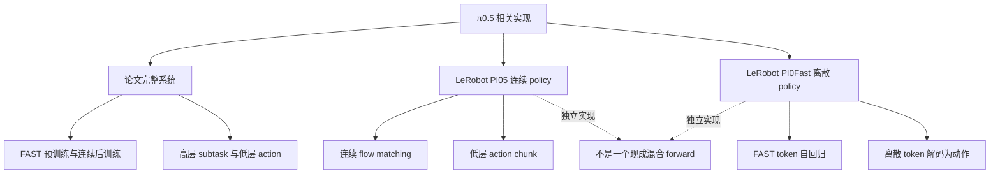

### 原理：为什么不能把三者合成一个 forward？

论文 Section IV-A 至 IV-D，PDF 第 4–7 页，描述一个共享 token 体系中的离散和连续目标，并在 Equation 1 中写出概念混合损失。当前源码却把职责拆成两个类：PI05 在 `modeling_pi05.py` 第 742–789 行收到 `actions noise time` 并返回逐元素 MSE；PI0Fast 在 `modeling_pi0_fast.py` 第 495–592 行收到 FAST token 和 mask 并返回 CE。因而下面的连续图和 FAST 图是两个独立可运行路径；论文混合目标另用概念图表示。

## 第一部分：数据采集与 LeRobotDataset

## 1. 数据采集形成同步样本

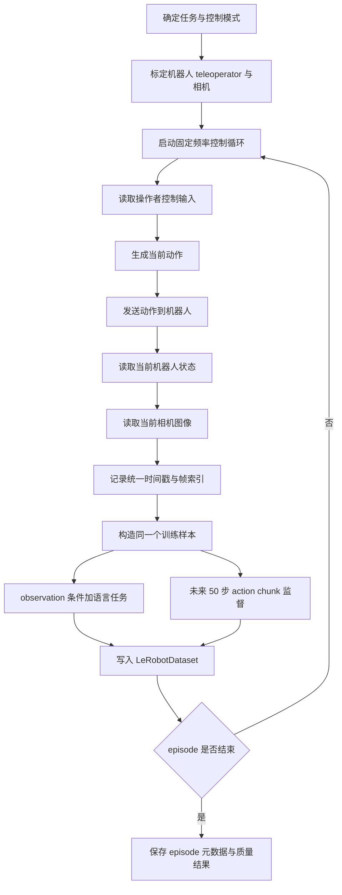

### 原理：observation 与未来 50 步为什么必须位于同一个样本节点？

训练问题是条件模仿学习：给定当前 `o_t` 和语言任务 `l`，预测从当前时刻开始的 `a_t` 到 `a_{t+49}`。因此一个样本可表示为：

```
sample_t = {
  observation.images: image_t,
  observation.state: state_t,
  task: l,
  action: [a_t, a_t+1, ..., a_t+49],
  episode_index: e,
  frame_index: t,
  timestamp: t / fps
}
```

图中 observation 和未来 chunk 是同一个 `sample_t` 的条件与目标，不是两个上下无关的分支。`PI05Config.action_delta_indices` 和 `PI0FastConfig.action_delta_indices` 都返回 `range(50)`，见各自 configuration 文件第 165–172、158–164 行。若 episode 末尾不足 50 步，数据读取器保持固定 shape，并用边界规则补齐，同时保留 padding 信息；这样 batch 仍是 `[B, 50, A]`。

## 2. LeRobotDataset 到 DataLoader

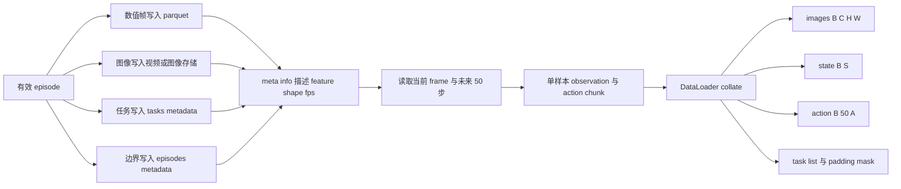

### 原理：一次 batch 里的 shape 怎样由磁盘记录转换而来？

单样本的 state 是 `[S]`，action 是 `[50, A]`，相机是 `[C, H, W]`，语言是字符串。默认 collate 在相同 key 上增加 batch 维，得到：

```
state  -> [B, S]
action -> [B, 50, A]
image  -> [B, C, H, W]
task   -> list[str] with length B
```

`stats.json` 不是模型权重，而是 state/action 变换的坐标定义。PI05 使用 `NormalizationMode.QUANTILES`，PI0Fast 当前配置使用 `MEAN_STD`，必须分别与训练时的 stats 和 action 表示匹配。任务文字仍然要经过 processor；DataLoader 本身只负责组织样本，不理解 prompt 的语义。

## 第二部分：PI05 连续处理器

## 3. PI05 processor 主链

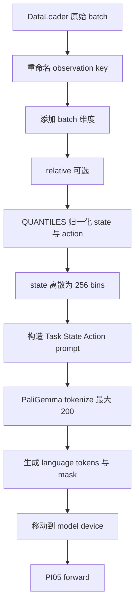

### 原理：PI05 processor 的顺序为什么不能调换？

源码 `processor_pi05.py` 第 132–158 行明确规定：relative 先于 normalize，normalize 先于 `Pi05PrepareStateTokenizerProcessorStep`，最后才是 `TokenizerProcessorStep`。relative 模式的概念转换是：

```
relative_action[i, j] = absolute_action[i, j] - state_t[j]
```

之后 state 和 action 按 dataset quantiles 映射到约定范围。state tokenizer 假定 state 已在 `[-1, 1]`，再将每个值映射到 256 个离散 bin。推理后必须按相反顺序执行 unnormalize，再在启用 relative 时加回缓存的当前 state。

## 4. state 离散和 prompt 形成

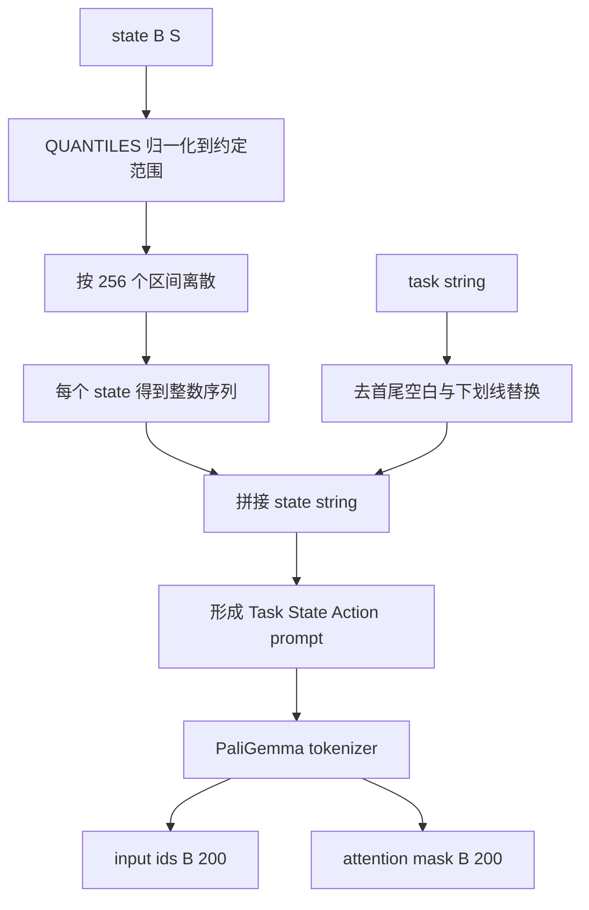

### 原理：state 的实际转换和 prompt 文本是什么？

`processor_pi05.py` 第 74–84 行先把 normalized state 转成 NumPy，再执行等价于 `digitize` 的 256 bin 量化；随后 prompt 精确采用：

```
Task: cleaned_task, State: d0 d1 ... dS;
Action: 
```

例如 normalized state 中一个值为 `0.2`，它会被映射到 0 到 255 的某个整数 bin，多个 state 值形成空格分隔序列。这里的 state 不再以独立连续 state token 送入 action suffix，而是作为语言 prompt 的文本内容进入 prefix。`PI05Config.tokenizer_max_length=200`，源码配置文件第 70 行和 processor 第 151–156 行给出最大长度、右侧 padding 与截断设置。

## 5. 图像预处理与 prefix

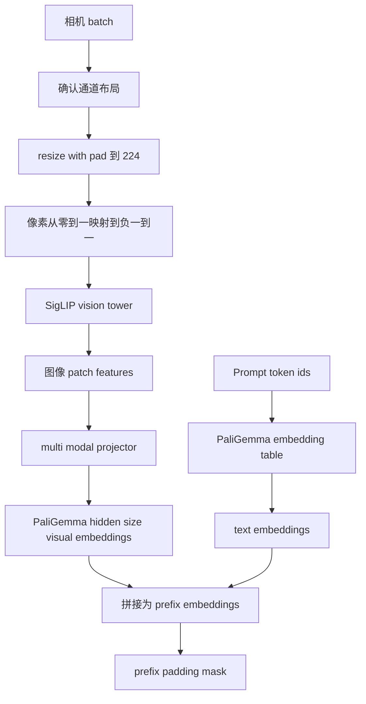

### 原理：图像和文本如何成为同一 prefix？

`PI05Policy._preprocess_images` 在 `modeling_pi05.py` 第 1149–1213 行把 LeRobot 图像调整为 `[B, C, 224, 224]`，并从 `[0,1]` 转成 SigLIP 需要的 `[-1,1]`。`PI05Pytorch.embed_prefix` 在第 653–693 行把每个相机的视觉 embedding 与 language embedding 沿序列维拼接。若某路相机缺失，会生成 padding 图像和 false mask。于是 prefix 形状可抽象为 `[B, N_prefix, 2048]`，其中 `N_prefix` 包括所有图像 patch 和 200 个文本位置，实际有效长度由 mask 决定。

## 第三部分：PI05 一次完整 forward

## 6. 连续 forward 总图

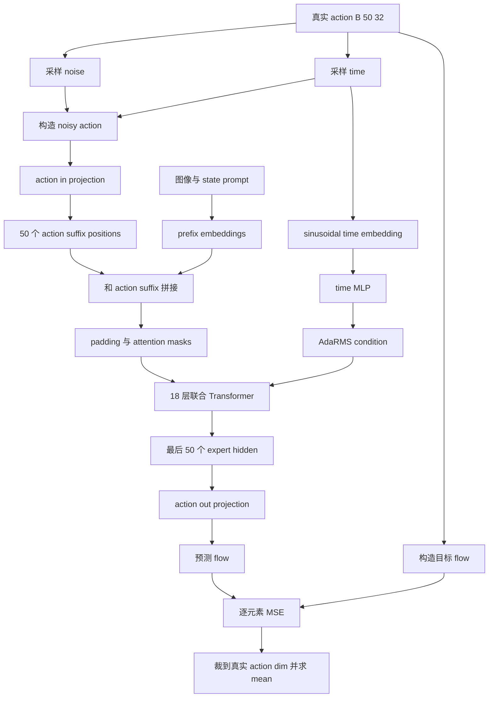

### 原理：PI05 的 `x_t`、`u_t` 和 shape 是什么？

`modeling_pi05.py` 第 742–746 行直接实现：

```
time_expanded = time[:, None, None]
x_t = time_expanded * noise + (1 - time_expanded) * actions
u_t = noise - actions
```

若 `actions`、`noise` 都是 `[B, 50, 32]`，`time` 是 `[B]`，则 `x_t` 和 `u_t` 都是 `[B, 50, 32]`。time 接近 1 时 `x_t` 接近 noise，接近 0 时接近真实 action。学习笔记指出论文 Equation 1 使用 `omega - a`，而对 `tau*a + (1-tau)*omega` 按递增 tau 求导得到 `a - omega`；这表示论文保留了一个积分方向约定，推理必须使用一致的反向积分符号。LeRobot PI05 的推理实现明确用 `dt=-1/num_steps`，见源码第 833–865 行。

## 7. PI05 suffix 只有 noisy action tokens

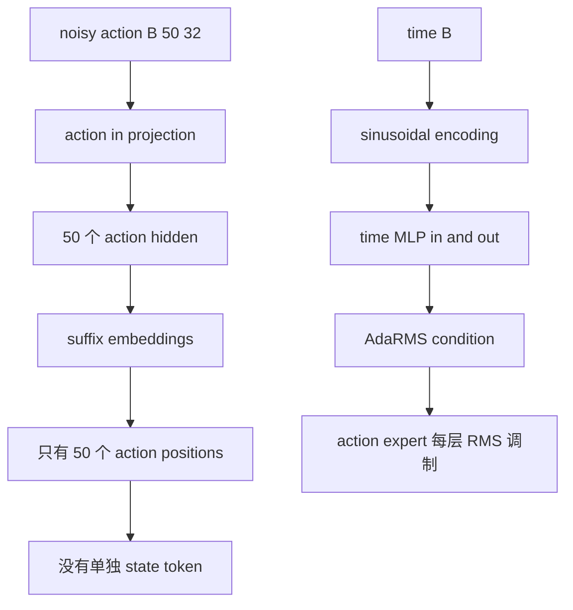

### 原理：相比 π0，PI05 的 suffix 和 time 注入具体差在哪里？

PI0 旧路径可以把 state、noisy action 和 time 融合成 suffix token；PI05 当前 `embed_suffix` 在 `modeling_pi05.py` 第 695–740 行只接收 `noisy_actions` 和 `timestep`，把 action 投影为 50 个位置，并把 time MLP 输出作为 `adarms_cond` 返回。源码第 579–587 行使用 `use_adarms=[False, True]`，所以 VLM 不启用 AdaRMS，action expert 启用 AdaRMS。

三个关键差异是：

- state 被写入 `Task ... State ... Action` prompt；
- suffix 不再单独放 state token；
- time 不与 action embedding concat，而是通过 action expert 的 AdaRMS 条件调制每层归一化。

因此 suffix shape 是 `[B, 50, expert_width]`，不是 `[B, 51, expert_width]`；state 信息通过 prefix 的文本路径进入 action expert。

## 8. 注意力 mask 和 token 路由

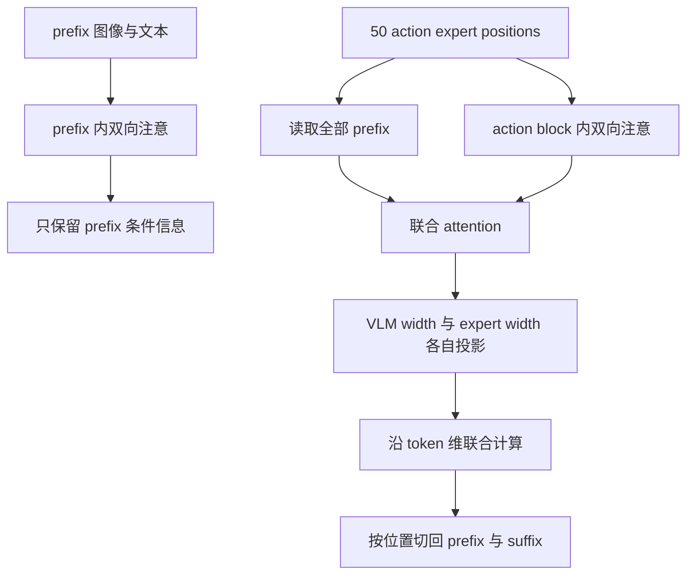

### 原理：mask 如何防止答案泄漏？

PI05 `embed_prefix` 的 `att_masks` 全为 prefix block，`embed_suffix` 在第 732–740 行建立 `[1, 0, ..., 0]` 的 action block：第一个 action 位置开启新 block，后 49 个共享该 block。`make_att_2d_masks` 在 `modeling_pi05.py` 第 110–139 行按累计 block 生成可见矩阵。因此 prefix 不能读取 action suffix，action suffix 能读取 prefix 和整个 action block。

论文 Section IV-A，PDF 第 5 页和 Appendix E Figure 18 进一步把 `rho` 定义为 token 类型路由：图像和文本进入 VLM，连续 action 进入 action expert。`rho` 是由 token 类型确定的 routing，不是随机 MoE gate。论文还要求 FAST token 与连续 expert 之间隔离，避免离散动作和 noisy 连续动作互相抄答案。

## 9. 18 层联合 Transformer

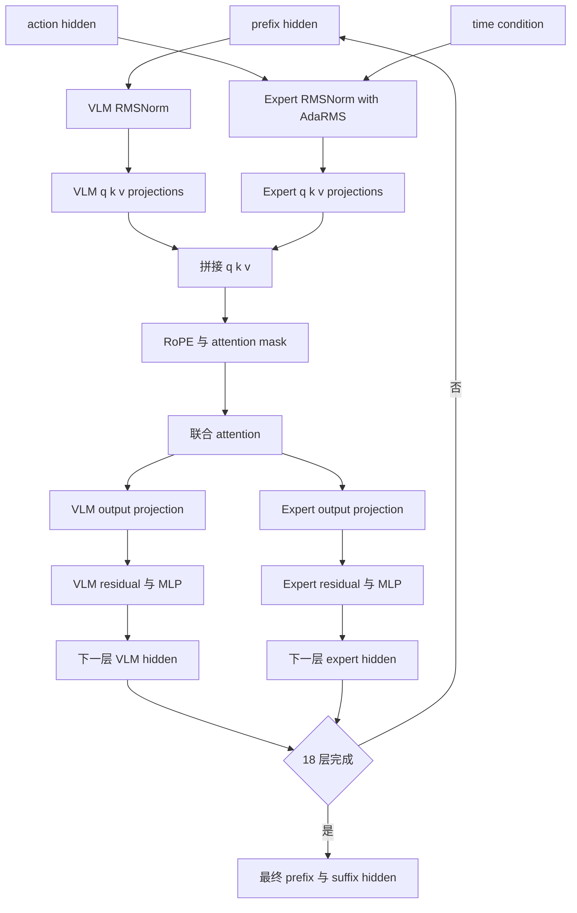

### 原理：所谓联合 Transformer 不是共享全部参数

`PaliGemmaWithExpertModel.forward` 在 `modeling_pi05.py` 第 460–560 行同时遍历 PaliGemma layer 和 Gemma expert layer。每一层先分别做 RMSNorm、QKV projection，再沿 token 维拼接，执行一次 attention，之后按原始位置切分，分别通过 VLM 和 expert 的 output projection、残差和 MLP。论文 Appendix E 给出的典型规模是 VLM width 2048、18 层，action expert width 1024、18 层。

例如 prefix 有 `N` 个位置、suffix 有 50 个位置，则联合 attention 的序列长度是 `N+50`，但 VLM hidden 的最后一维仍是 2048，expert hidden 的最后一维仍是 1024。联合表示来自 attention 的跨分支读取，不是把两个线性层粗暴地合成同一个参数矩阵。

## 10. 输出层与连续 loss

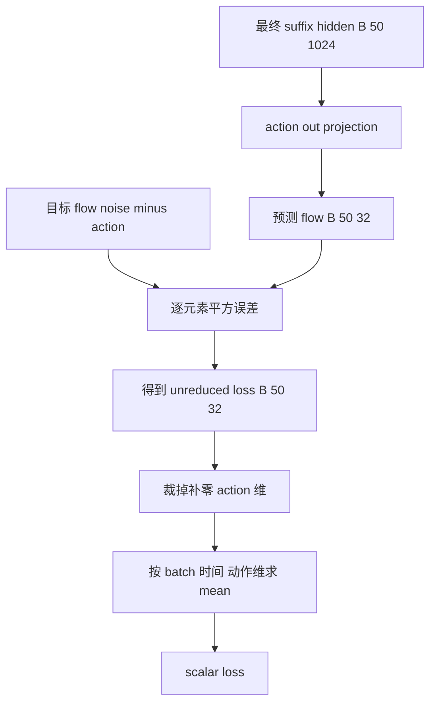

### 原理：为什么必须先裁维再求平均？

PI05 配置为所有机器人统一补到 `max_action_dim=32`，见 `configuration_pi05.py` 第 39–40 行；实际机器人可能只有 `A=7` 或 `A=18`。`PI05Policy.forward` 在 `modeling_pi05.py` 第 1268–1279 行先把动作补到 32，模型返回 `[B, 50, 32]` 的 MSE 后，再按真实 output feature shape 裁成 `[B, 50, A]`。否则补零维度会进入 loss，改变不同机器人之间的损失权重。

对单元素，若预测 `v=0.7`、目标 `u=0.5`，则：

```
loss = (v-u)^2 = 0.04
dloss/dv = 2*(v-u) = 0.4
```

源码第 789 行使用 `F.mse_loss(u_t, v_t, reduction="none")`，因此逐元素 loss 到标量的平均发生在 policy 外层。

## 第四部分：PI05 反向传播与优化

## 11. 连续 loss 的梯度路径

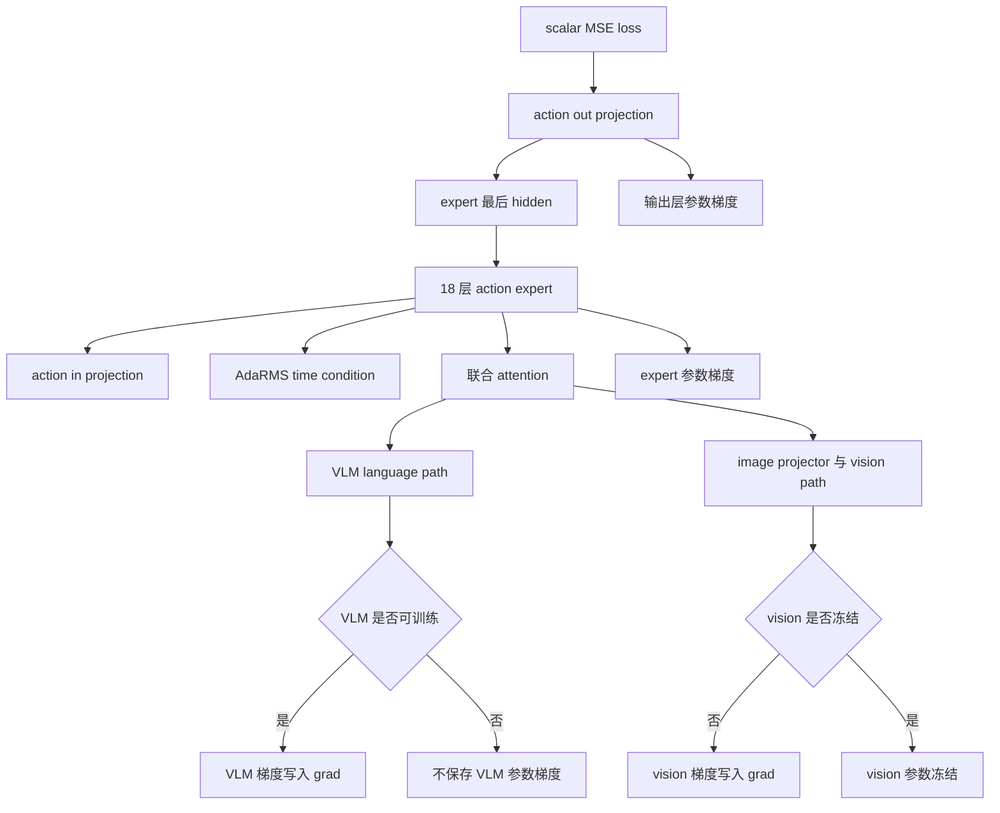

### 原理：freeze 配置改变哪一段梯度？

`PI05Pytorch` 在 `modeling_pi05.py` 第 579–587 行把配置传入 `PaliGemmaWithExpertModel`。第 429–444 行的 `_set_requires_grad` 规定：`freeze_vision_encoder=True` 时 vision tower 进入 eval 且参数 `requires_grad=False`；`train_expert_only=True` 时整个 PaliGemma 冻结，只训练 action expert 和投影层。

所以普通全量训练时，MSE 梯度可沿 `action_out_proj -> expert -> cross attention -> VLM language -> image projector -> vision tower` 传播；冻结 vision 时，图像特征仍作为 forward 输入，但 vision 权重没有梯度；expert-only 时，prefix 的 VLM 参数全部冻结，梯度仍可经过固定 VLM 的数值路径影响 expert 参数，但不会写入 VLM 参数的 `.grad`。这与“没有图像条件”不同，冻结只是停止参数更新。

## 12. 训练 step 到 AdamW

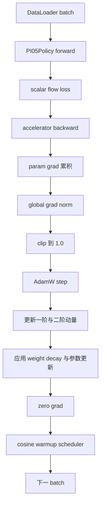

### 原理：AdamW 的一次更新怎样使用梯度？

PI05 配置文件第 90–101 行给出 `lr=2.5e-5`、`betas=(0.9,0.95)`、`weight_decay=0.01`、`grad_clip_norm=1.0`，并使用带 warmup 的 cosine scheduler。概念上：

```
m_t = beta1*m_prev + (1-beta1)*g_t
v_t = beta2*v_prev + (1-beta2)*g_t^2
theta = theta - lr*m_hat/(sqrt(v_hat)+eps)
theta = theta - lr*weight_decay*theta
```

clip 先限制全部可训练参数梯度的整体 norm，避免某个 batch 的异常误差造成过大更新。`zero_grad` 防止下个 batch 将旧梯度继续累加；scheduler 再决定下一步 learning rate。PI05 只有在配置允许的参数上更新，冻结参数不应出现在有效优化参数集合中。

## 第五部分：论文混合训练和层级系统

## 13. 论文的概念混合目标

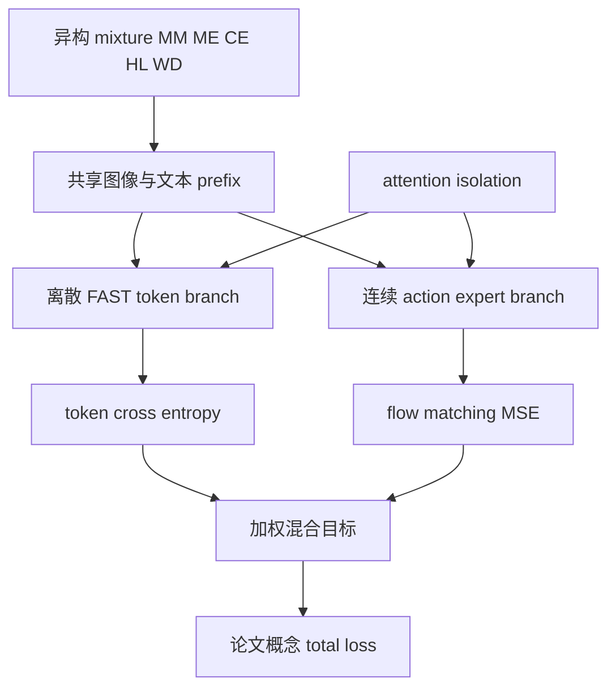

### 原理：论文两阶段训练和 rho 的含义

论文 Section IV-C，PDF 第 6–7 页 Figure 4 描述约 280k steps 的预训练：MM、ME、CE、HL、WD 中的机器人动作主要先经过 FAST 编码，模型做标准 next-token prediction；Section IV-D，PDF 第 7 页描述约 80k steps 的后训练，筛选 MM/ME、保留 HL/WD、加入 VI，并训练连续 action expert，同时保留 token 分支。学习笔记记录的论文后训练概念权重是 `alpha=10.0`，预训练阶段 `alpha=0`。

`rho` 由 token 类型决定：image patch 与文本使用 VLM，FAST token 使用 VLM 的文本路径，continuous action 使用 action expert。它不是随机 mixture-of-experts gate。attention mask 让 prefix 双向可见，FAST 对 prefix 可见且自身 causal，连续 action 看 prefix 和 action block，但动作表示之间不能互相读取。这样共享语义条件，却不让两种动作目标互相泄漏。

当前 LeRobot PI05 和 PI0Fast 没有把这张图实现成同一次调用：必须分别查看本文件第 6 节的 PI05 forward 和第 17 节的 PI0Fast forward。

## 14. 论文高层到低层完整链

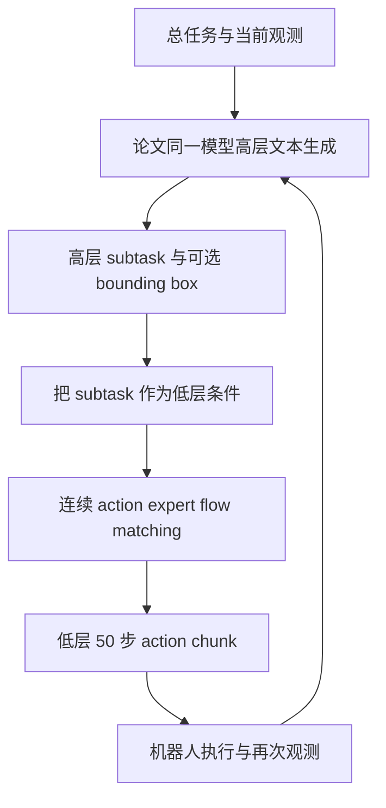

### 原理：高层和低层在论文中怎样分工？

论文 Section IV-A，PDF 第 4–5 页 Figure 3 将联合分布写成：

```
pi(a_chunk, subtask | observation, task)
= pi(a_chunk | observation, subtask) * pi(subtask | observation, task)
```

例如总命令是 `clean the bedroom`，高层先生成 `pick up pillow`，低层再在图像、状态和该 subtask 条件下生成动作 chunk。高层运行频率低于低层。论文 Section V-E，PDF 第 10–11 页 Figure 13 比较了显式 high-level、implicit HL、no HL、GPT-4 HL 与 human HL。

必须区分论文系统与源码：当前 `PI05Policy.select_action` 在 `modeling_pi05.py` 第 1221–1235 行只处理 action queue，`predict_action_chunk` 在第 1237–1253 行直接调用连续采样；它不会自动先调用一个高层文本生成器。LeRobot PI05 当前主要是低层策略接口。

## 第六部分：PI05 连续推理

## 15. prefix KV cache 和 10 步反向 Euler

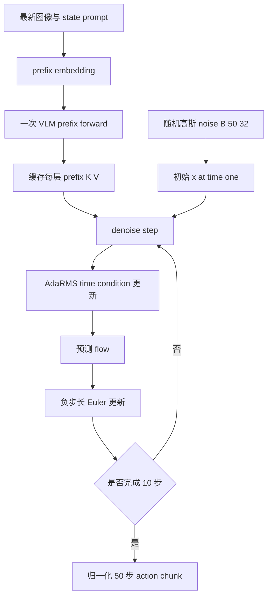

### 原理：每一步实际改变什么？

源码 `sample_actions` 第 809–869 行先采样 `[B,50,32]` noise，再以 `dt=-1/num_steps` 设置 10 步。每一步：

```
time = 1.0 + step*dt
v_t = denoise_step(x_t, time, prefix_cache)
x_next = x_t + dt*v_t
```

例如 `x_1=-0.4`、模型输出 `v_1=-1.2`，则 `x_0.9=-0.4+(-0.1)*(-1.2)=-0.28`。`denoise_step` 第 871–908 行重新编码当前 `x_t` 和当前 time，重新生成 time MLP 的 AdaRMS condition；只复用不变 prefix 的 K/V。PI05 配置默认 10 steps，见 `configuration_pi05.py` 第 43–48 行。

## 16. PI05 后处理与 queue

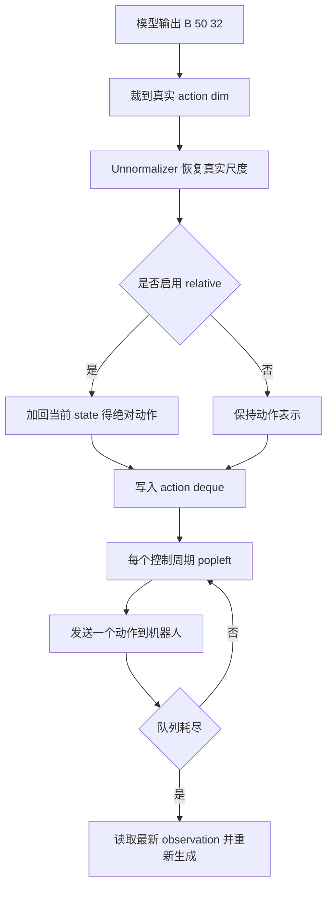

### 原理：为什么后处理顺序是裁维、反归一化、再恢复绝对值？

PI05 processor 的 output steps 在 `processor_pi05.py` 第 160–165 行依次是 `UnnormalizerProcessorStep`、`AbsoluteActionsProcessorStep`、CPU device step。若 normalized prediction 为 `0.5`，某维 stats 为 mean `1.0`、scale `0.4`，先得到真实相对值 `1.2`；若当前 state 是 `0.3`，绝对动作才是 `1.5`。若先把 `0.5` 与真实 state 相加，再反归一化，两个坐标系会被错误混合。

`select_action` 第 1229–1235 行在 queue 为空时生成 chunk，截取 `n_action_steps`，转成 `[time, batch, action_dim]` 后放入 deque；队列非空时不会再次运行模型。标准同步模式和 RTC 是两层不同机制：RTC 可把新 chunk 的请求与旧动作执行并行，但仍需考虑 inference delay、旧 chunk 剩余量和 execution horizon。

## 第七部分：PI0Fast 预处理与 FAST 原理

## 17. PI0Fast processor 主链

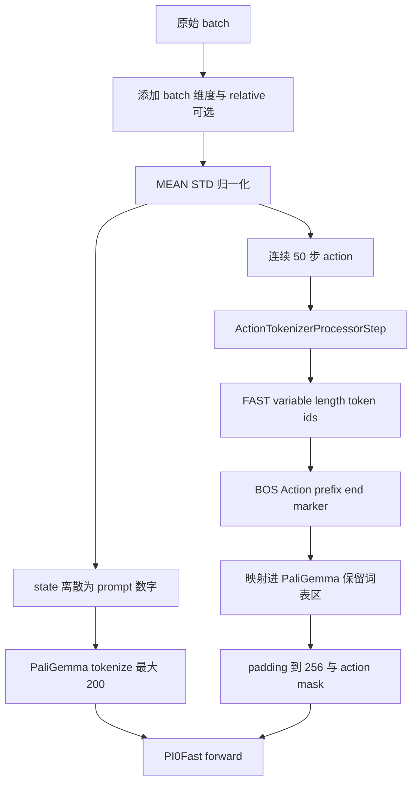

### 原理：源码 wrapper 和 FAST 算法内部原理必须区分

`ActionTokenizerProcessorStep` 在 `tokenizer_processor.py` 第 356–393 行通过 `AutoProcessor.from_pretrained` 加载预训练 FAST processor，同时加载 PaliGemma tokenizer；第 433–530 行对每个 `[50,A]` action 调用 wrapper，添加 BOS、`Action: `、动作 token、`|`，映射 token ID，并 padding 到 `max_action_tokens=256`。这描述的是源码接口调用，不等于重新实现 FAST 算法。

FAST 的算法原理可概念化为：

```
50 x A continuous action
-> transform action sequence into frequency domain
-> retain or quantize DCT like coefficients
-> map coefficient symbols into compact code units
-> apply BPE like merging
-> obtain variable length integer sequence
```

也就是说，50 步乘动作维度的连续值先被频域系数压缩和量化，再通过类似 BPE 的合并形成可变长序列。源码 wrapper 负责调用预训练 tokenizer；模型只看到已经映射到 PaliGemma 保留词表区的整数 token。PI0Fast 配置第 61–69 行给出 tokenizer 名称、`max_action_tokens=256`、`fast_skip_tokens=128` 和 prefix 校验开关。

## 18. FAST token 的词表映射和 padding

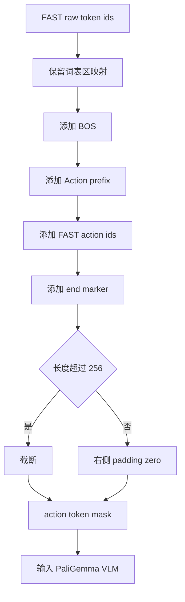

### 原理：一个训练 token 序列包含什么？

源码 `tokenizer_processor.py` 第 479–511 行构造：

```
[BOS] + encode("Action: ") + mapped_fast_tokens + encode("|") + PAD
```

映射公式在第 427–431 行是：

```
paligemma_id = paligemma_vocab_size - 1 - fast_skip_tokens - fast_id
```

这样 FAST token 被放入 PaliGemma 词表的保留区域，避免与普通语言 token 的编号直接重合。`action_token_mask` 对真实 token 为 true，对 padding 为 false；训练时还要在 next-token shift 后同步右移 mask。若 token 数超过 256，源码截断并将 mask 全部设为有效，因此增大 `max_action_tokens` 是避免频繁丢失末端信息的配置选择。

## 第八部分：PI0Fast 完整 forward

## 19. FAST attention 结构

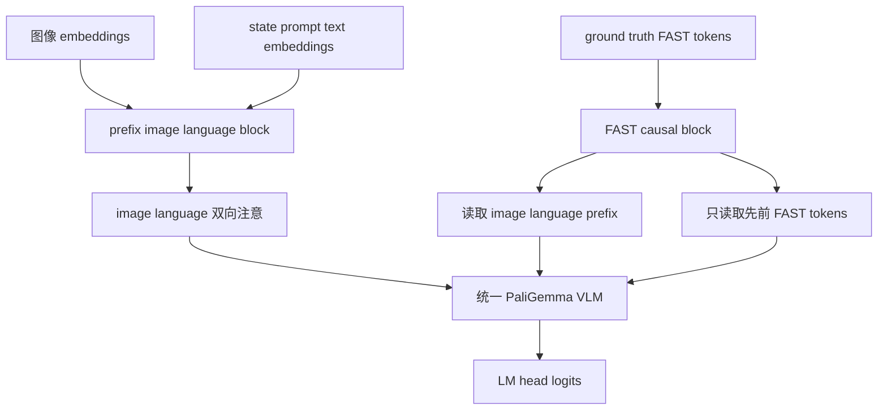

### 原理：image language 双向和 FAST causal 如何落地？

`modeling_pi0_fast.py` 第 368–493 行的 `_create_custom_attention_mask_fast` 构造三类关系：image 与 language 互相可见；FAST query 可以读取 image 和 language；FAST 对 FAST 使用下三角 causal mask。padding mask 再将无效位置关闭。

例如序列是 `[image1, text1, text2, fast1, fast2]`，`fast2` 能读取前三个 prefix 位置和 `fast1`，但 `fast1` 不能读取 `fast2`。这使语言和视觉提供完整条件，而 FAST 输出仍然是标准 next-token prediction。PI0Fast 没有 PI05 的 noisy continuous suffix，也没有 action expert 的 50 个连续位置。

## 20. FAST cross entropy forward

```mermaid
flowchart TD
    A[images] --> B[embed prefix fast]
    C[language state prompt tokens] --> B
    D[ground truth FAST tokens] --> B
    B --> E[PaliGemma 18 层 forward]
    E --> F[FAST hidden positions]
    F --> G[LM head logits]
    G --> H[shift logits left]
    D --> I[shift targets right]
    I --> J[padding mask 对齐]
    H --> K[token cross entropy]
    J --> K
    K --> L[mask padding]
    L --> M[有效 token mean loss]
```

### 原理：PI0Fast 的 loss shape 和 shift 是什么？

`modeling_pi0_fast.py` 第 495–592 行先将 image、language 和 ground truth FAST token 放入同一个 PaliGemma VLM。取最后 `T` 个 FAST 相关 hidden 后，LM head 得到 `[B,T,V]` logits。next-token 训练将：

```
logits = logits[:, :-1, :]
targets = tokens[:, 1:]
mask = action_mask[:, 1:]
```

逐 token cross entropy 得到 `[B,T-1]`，再乘 boolean mask，仅对有效 action token 求和除以有效数量。PI0Fast `PI0FastPolicy.forward` 第 1326–1359 行只从 batch 取 `ACTION_TOKENS` 和 `ACTION_TOKEN_MASK`，不采样 noise/time，不调用 action expert，也没有 flow MSE。

## 21. FAST 反向传播与 AdamW

```mermaid
flowchart TD
    A[masked CE scalar] --> B[LM head]
    B --> C[FAST hidden]
    C --> D[PaliGemma language layers]
    D --> E[image path]
    D --> F[text and state prompt path]
    E --> G[vision encoder parameters]
    F --> H[language embedding and VLM parameters]
    C --> I[CE gradient at valid token positions]
    I --> J[clip gradients]
    J --> K[AdamW update]
    K --> L[zero grad and scheduler]
```

### 原理：FAST-only 的梯度与 PI05 有何不同？

对于有效 token `i`，交叉熵的 softmax 梯度是预测概率与 one-hot target 的差；padding 位置乘以 0 后不贡献梯度。梯度从 LM head 经过 FAST hidden 反向进入 PaliGemma 的 language layers，并沿 attention 回到 state prompt、语言 token 和图像 patch。PI0Fast 当前配置没有 `freeze_vision_encoder` 或 `train_expert_only` 选项，因此是否冻结通常由外层训练策略决定；源码模型本身没有 PI05 的 action expert continuous path。

优化器参数仍可使用配置中的 AdamW、gradient clipping、warmup 和 cosine decay，但目标是 CE。论文里的 `L_token + alpha L_flow` 不能据此推断 PI0Fast 会同时产生 flow gradient。

## 第九部分：PI0Fast 推理和部署

## 22. FAST 自回归生成

```mermaid
flowchart TD
    A[当前图像与 state prompt] --> B[添加 BOS]
    B --> C[prefix prefill]
    C --> D[得到 prefix KV cache]
    D --> E[LM head 预测下一个 token]
    E --> F[temperature 或 argmax 采样]
    F --> G[追加 token 与 cache]
    G --> H{终止 marker 或达到 256}
    H -- 否 --> E
    H -- 是 --> I[生成 FAST token sequence]
```

### 原理：KV cache 版本和安全版本的差异

PI0Fast 配置 `use_kv_cache=True` 时，`sample_actions_fast_kv_cache` 在 `modeling_pi0_fast.py` 第 689–810 行先对图像、prompt、BOS 做一次 prefill，再逐 token 传入上一轮的 cache；每一步只计算新 token 的 hidden 和 logits。配置关闭 KV cache 时，源码第 594–687 行的安全版本会重复计算完整序列，结果语义相同但更慢。

生成最多 `max_decoding_steps=256` 个 token，temperature 为 0 时使用 argmax，大于 0 时对 logits 做 softmax 后 multinomial 采样。当前源码推理循环按最大步数运行，终止 marker 的有效截断和后处理由 detokenize 阶段识别 `|`；部署文档应同时写“遇到终止标记或达到最多 256”的语义边界。

## 23. FAST 逆映射与连续动作恢复

```mermaid
flowchart TD
    A[PaliGemma generated ids] --> B[校验 Action prefix]
    B --> C[截断到 end marker]
    C --> D[移除 Action prefix]
    D --> E[映射回 FAST token ids]
    E --> F[逆 BPE 概念展开]
    F --> G[反量化频域系数]
    G --> H[IDCT 概念逆变换]
    H --> I[得到 50 x action dim continuous]
    I --> J[unnormalize 与 absolute action 还原]
    J --> K[action queue]
```

### 原理：token 怎样还原为 50 步动作？

`PI0FastPolicy.detokenize_actions` 在 `modeling_pi0_fast.py` 第 1120–1262 行先把 PaliGemma ids 转成 token strings，遇到 `|` 后截断，删除 `Action: `，再按第 1118 行的逆映射恢复 FAST token。`decode_actions_with_fast` 第 1137–1174 行调用 BPE tokenizer 解码出字符形式的系数，转成量化 DCT coefficient，除以 tokenizer scale，最后调用 `idct` 得到 `[time_horizon, action_dim]`。

概念逆链是：

```
PaliGemma id
-> FAST id
-> inverse BPE merge
-> dequantized frequency coefficients
-> inverse DCT
-> continuous action[50, A]
```

源码实现允许 relaxed decoding：系数过长则截断，过短则补 0，保证 shape 为 `[50,A]`。之后 postprocessor 再执行归一化逆变换；若启用 relative action，还要加回当时缓存的 state，最后进入 deque。

## 24. FAST queue 与机器人执行

```mermaid
flowchart TD
    A[FAST 连续 action chunk B 50 A] --> B[postprocessor]
    B --> C[恢复真实 action 数值]
    C --> D[裁取 n action steps]
    D --> E[transpose time batch action]
    E --> F[写入 deque]
    F --> G[popleft 一个动作]
    G --> H[机器人控制器执行]
    H --> I{队列是否为空}
    I -- 否 --> G
    I -- 是 --> J[最新 observation 再次生成]
```

### 原理：离散 token 生成最终仍要变成连续控制接口

虽然 PI0Fast 的模型输出是整数 token，`predict_action_chunk` 第 1281–1324 行在生成后调用 `detokenize_actions`，参数是 `action_horizon=n_action_steps` 和真实 action dim，最终返回连续 action tensor。`select_action` 第 1264–1279 行与 PI05 一样使用 action queue，每次只弹出一个控制周期动作。

如果 chunk 是 `[B,50,A]`，转置后为 `[50,B,A]`，deque 的每个元素就是一个 `[B,A]` 动作。队列耗尽才基于最新 observation 重新执行图像、prompt、FAST 自回归、逆变换和后处理。FAST 的 256 是 token 上限，不等于动作步数；动作步数仍由 horizon 50 和解码出的系数 shape 决定。

## 第十部分：总链与核对表

## 25. 论文概念链与当前源码链并列

```mermaid
flowchart TD
    A[采集同步 episode] --> B[LeRobotDataset 样本]
    B --> C[PI05 processor]
    C --> D[PI05 连续 forward]
    D --> E[flow MSE backward AdamW]
    E --> F[PI05 checkpoint]
    B --> G[PI0Fast processor]
    G --> H[FAST CE forward]
    H --> I[CE backward AdamW]
    I --> J[PI0Fast checkpoint]
    K[论文预训练 FAST] --> L[论文后训练 flow 与 token]
    L --> M[论文高层 subtask]
    M --> N[论文低层连续 action]
```

### 原理：同一数据可以进入两条独立 LeRobot 训练路径

同一份 LeRobotDataset 可以提供 `[B,50,A]` action chunk 和 observation。PI05 processor 保留连续 action，按 QUANTILES 归一化并用于随机 `noise/time` 的 flow 训练；PI0Fast processor 把连续 action 交给预训练 FAST tokenizer，得到 `[B,256]` token 和 mask，再做 CE。两条路径共享图像、语言和 state prompt 的语义输入方式，但模型目标、suffix 结构、推理算法完全不同。

论文链则在更高抽象层描述同一模型权重体系：预训练阶段用 FAST 让异构 mixture 学 next-token；后训练加入连续 expert 和 flow loss；运行时先做高层文本生成，再把 subtask 作为低层连续动作条件。当前 LeRobot PI05 不会自动执行其中的高层步骤，PI0Fast 也不包含连续 flow expert。

## 26. 训练与推理最终对照

| 项目 | 论文 π0.5 概念 | LeRobot PI05 | LeRobot PI0Fast |
|---|---|---|---|
| 动作目标 | token 与 flow 混合 | 连续 flow MSE | FAST CE |
| state 输入 | prompt 离散 state | prompt 离散 state | prompt 离散 state |
| suffix | 连续 action expert | 50 noisy action positions | 无 action expert suffix |
| time | 连续 flow timestep | AdaRMS condition | 不使用 |
| token 上限 | 论文概念序列 | PaliGemma max 200 prompt | prompt 200 plus action 256 |
| 推理 | 高层文本后低层 flow | 10 步反向 Euler | 自回归 token 解码 |
| action restore | 连续后处理 | unnormalize plus optional absolute | FAST inverse transform plus unnormalize |
| queue | 机器人执行层 | deque 与可选 RTC | deque |
| 是否现成同一 forward | 论文概念上是 | 否 | 否 |

### 原理：如何避免把实现事实扩大成论文事实？

源码事实应引用本地路径和行号：PI05 连续计算在 `modeling_pi05.py` 第 742–789 行，PI0Fast CE 在 `modeling_pi0_fast.py` 第 495–592 行；PI05 推理在第 791–908 行，PI0Fast 推理在第 594–810 行。论文事实应引用 PDF 页码和 Section：混合目标在 PDF 第 5 页 Section IV-B Equation 1；预训练和后训练在第 6–7 页 Section IV-C 和 IV-D；高层低层分解在第 4–5 页 Section IV-A Figure 3；attention 隔离在第 5 页和 Appendix E Figure 18。

因此，文中可以说“论文提出统一混合体系”，不能说“当前 `PI05Policy.forward` 已经同时计算 token CE 和 flow MSE”；可以说“论文系统先生成 high-level subtask”，不能说“当前 `PI05Policy.select_action` 自动先做高层生成”。

## 27. 最短完整链

```
同步采集 image state task action timestamp
-> 当前 frame 与未来 50 步组成同一个 LeRobotDataset 样本
-> DataLoader 得到 observation 条件和 action chunk
-> PI05 路径 relative 可选、QUANTILES、256 bin state prompt、PaliGemma tokenize 200
-> image plus state prompt 形成 prefix
-> sample noise and time
-> x_t = time*noise + (1-time)*action
-> u_t = noise-action
-> 50 noisy action positions plus AdaRMS time condition
-> 18 层联合 VLM and action expert
-> action_out_proj
-> MSE、裁真实维度、mean
-> backward、clip、AdamW、zero_grad、scheduler
-> checkpoint
-> 部署时 prefix KV cache、随机 noise、10 步反向 Euler、每步更新 AdaRMS
-> unnormalize、可选恢复绝对动作、deque、机器人执行

或选择 PI0Fast 独立路径：

同步采集样本
-> relative 可选、MEAN STD、state prompt、PaliGemma tokenize
-> 50xA action 经 FAST 频域量化与 BPE 概念压缩
-> BOS、Action prefix、终止标记、映射到 PaliGemma 区、padding 256
-> image language 双向、FAST causal
-> LM head、shift、mask padding、cross entropy
-> backward、AdamW
-> image plus prompt KV cache
-> 自回归至终止或 256
-> FAST inverse BPE、反量化、IDCT
-> 得到 50xA、unnormalize、absolute、queue、机器人执行
```

## 28. 事实边界总结

- **论文 π0.5 完整系统**的 `L_token + alpha L_flow`、异构 mixture、ρ routing、attention isolation、高层 subtask 与低层 flow 是论文层面的统一设计，见学习笔记第 3–7 节及 PDF 第 4–7 页。
- **LeRobot PI05** 是连续低层 Flow Matching policy：state 在 prompt，suffix 只有 50 个 noisy action positions，time 经 sinusoidal embedding 和 MLP 后用 action expert AdaRMS 注入，`use_adarms=[False, True]`。
- **LeRobot PI0Fast** 是离散 FAST-only policy：训练输入包含 ground-truth FAST tokens，使用 PaliGemma VLM 和 LM head 做 masked next-token CE，推理后调用 FAST 解码得到连续动作。
- 两个 LeRobot policy 都可以服务同一类 50 步 action chunk，但不能据此声称源码已经实现论文混合 forward，也不能据此声称 PI05 的 `select_action` 自动完成论文高层生成。
