# π0 从数据采集到训练与部署：详细实现图

本文按 LeRobot 当前源码整理，不只描述概念，还展开到数据结构、函数调用、张量变换、前向传播、自动微分、优化器更新、Flow Matching 积分和 action queue。

阅读方式：流程图只保留主链路。图下方的原理内容直接展开；需要了解某个节点“内部怎样转换、为什么这样做、张量如何变化”时，可阅读对应的“展开原理”小节。

主要代码：

- `lerobot/src/lerobot/policies/pi0/configuration_pi0.py`
- `lerobot/src/lerobot/policies/pi0/processor_pi0.py`
- `lerobot/src/lerobot/policies/pi0/modeling_pi0.py`
- `lerobot/src/lerobot/scripts/lerobot_train.py`

## 0. 先区分三种容易混淆的“循环”

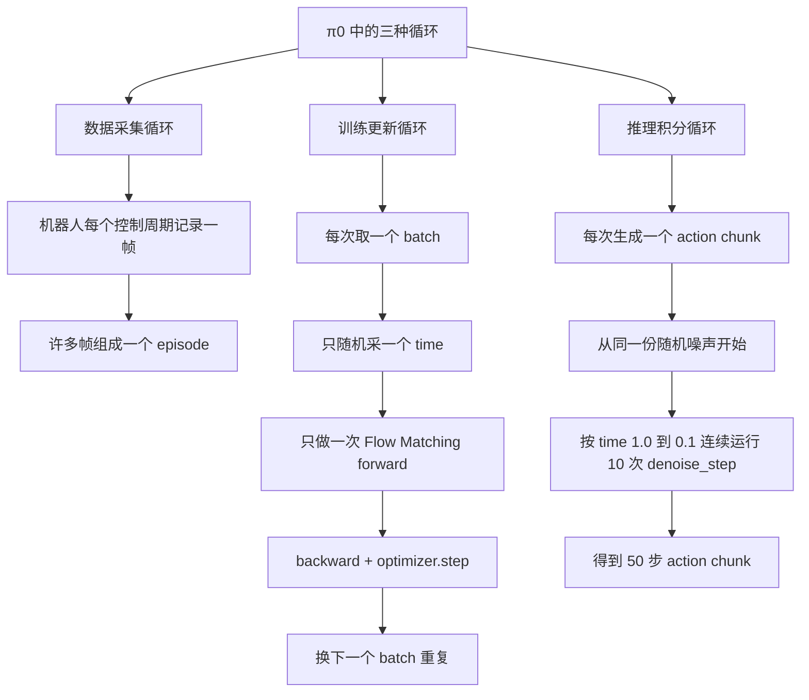

关键区别：

- 训练不是对一个样本去噪 10 次，而是在大量 batch 中随机覆盖不同 `time`。
- 推理参数固定，不做 `backward()`，只对当前噪声连续积分 10 次。
- 机器人执行 action chunk 又是第三种时间循环，与模型的 10 个 flow steps 不同。

---

## 0.5 数据流：同一份信息在模型不同位置是什么类型

下面先用极简导航定位一次训练 forward，再用六张独立小图展开。每个数据节点依次写“语义对象｜物理载体｜shape”。

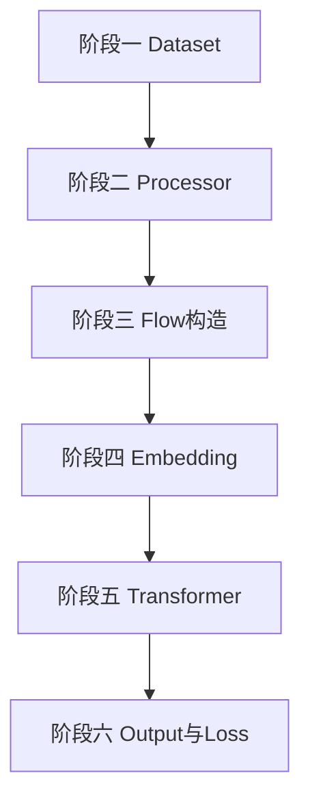

#### 阶段一：Dataset 原始样本

进入阶段时是机器人采集记录，离开阶段时是包含任务、视觉、状态与动作的原始样本。

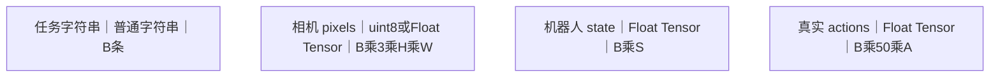

#### 阶段二：Processor 预处理

进入阶段时是 Dataset 原始样本，离开阶段时是可直接组成模型 batch 的定长 Tensor。

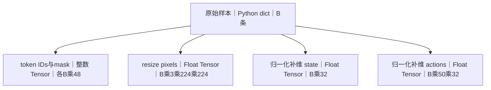

#### 阶段三：Flow 题目构造

进入阶段时是归一化 actions，离开阶段时是模型输入 `x_t` 与监督目标 `u_t`。

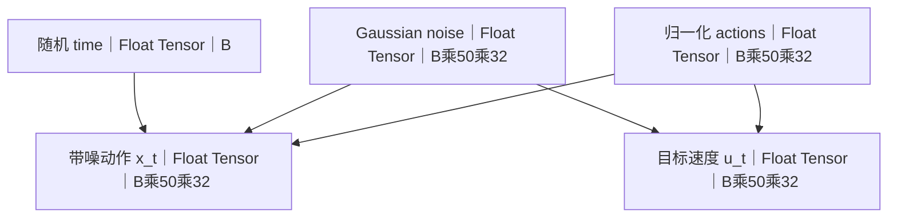

Flow Matching 题目为 `x_t = time * noise + (1 - time) * actions`，监督目标为 `u_t = noise - actions`。

#### 阶段四：Input Embedding

进入阶段时是 Processor Tensor 与 Flow 输入，离开阶段时是送入联合 Transformer 的四类 embedding。

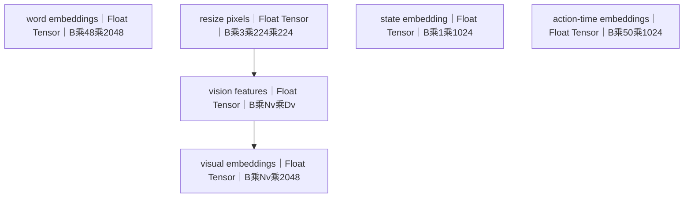

#### 阶段五：18 层联合 Transformer

进入阶段时是 word、visual、state 与 action-time embeddings，离开阶段时是上下文化的 prefix、suffix 与 action hidden states。

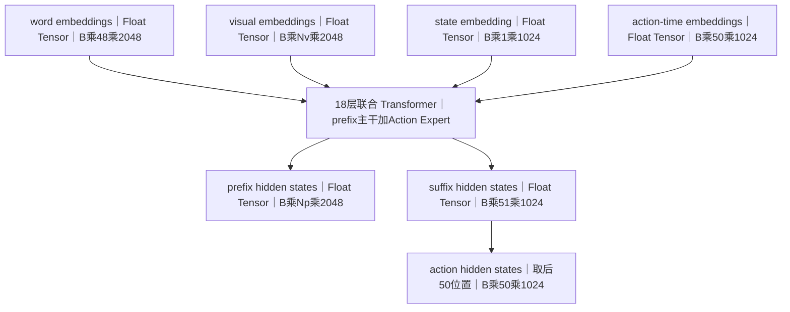

`Np = Nv + 48`。prefix 与 suffix 在同一次 18 层 Transformer forward 中联合计算；state 是 suffix 的第一个位置，当前 `adarms_cond=None`。

#### 阶段六：Output Head 与 Loss

进入阶段时是 action hidden states 与目标 `u_t`，离开阶段时是预测速度 `v_t` 和标量 MSE loss。

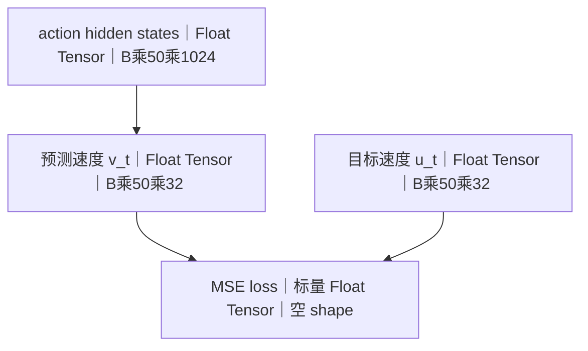

损失为 `mean((v_t - u_t) ** 2)`。

特别要注意：token 是符号或语义片段，不是 Tensor；token ID 才是整数 Tensor。embedding 和 hidden state 仍是 Float Tensor，前者与后者描述网络阶段角色，Tensor 描述物理载体。

| 易混淆术语 | 准确含义 |
|---|---|
| token 与 token ID | token 是符号片段；token ID 是整数 Tensor |
| embedding 与 hidden state | 都是 Float Tensor；前者是网络输入表征，后者是 Transformer 上下文化表征 |
| prefix 与 suffix | prefix 承载图像和文本；suffix 承载 state 和 action-time |
| `x_t`、`u_t`、`v_t` | 都是 Float Tensor，依次是模型输入、监督目标和模型预测 |

### π0 中每种数据的完整形态转换链

#### 文本数据流

文本从普通字符串变成 token 符号，再变成整数 ID、Float embedding 和上下文化 hidden state。

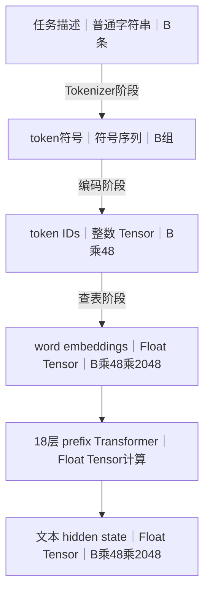

attention mask 与 token IDs 同时产生，载体为整数 mask Tensor，shape 为 `B乘48`，并在 Transformer 阶段约束注意力。

| 阶段 | 进入时 | 离开时 |
|---|---|---|
| Tokenizer | 任务普通字符串 | token 符号序列 |
| 编码 | token 符号序列 | token IDs 与 attention mask |
| Embedding | 整数 token IDs | Float word embeddings |
| Transformer | word embeddings | 文本 hidden state |

#### 图像数据流

图像从相机 pixels 变成 Processor Float Tensor，再依次变成 vision features、visual embeddings 和视觉 hidden state。

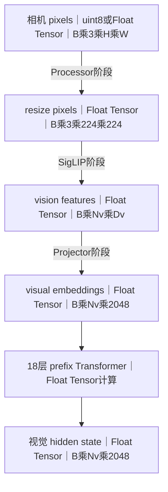

相机有效标记从布尔 Tensor `B` 扩展为 visual token mask `B乘Nv`，与 visual embeddings 一同进入 Transformer；视觉路径不存在整数 visual token ID。

| 阶段 | 进入时 | 离开时 |
|---|---|---|
| Processor | 原始相机 pixels | resize 与归一化 Float Tensor |
| Vision Encoder | Processor pixels | vision features |
| Projector | vision features | visual embeddings |
| Transformer | visual embeddings 与 mask | 视觉 prefix hidden state |

#### State 数据流

state 以连续 Float Tensor 进入，经过归一化与补维后形成 state embedding，最后成为 suffix 中的 state hidden state。

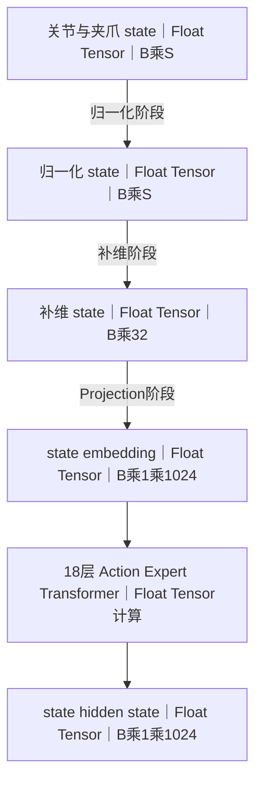

| 阶段 | 进入时 | 离开时 |
|---|---|---|
| Processor 归一化 | 连续原始 state | 归一化 state |
| Processor 补维 | `B乘S` Float Tensor | `B乘32` Float Tensor |
| Projection | 补维 state | suffix 的 state embedding |
| Transformer | state embedding | state hidden state |

#### 训练 action 数据流

训练 action 从真实动作变成 Flow 输入与监督目标，再由 Transformer 预测速度并计算标量损失。

##### Flow 题目构造

进入时是真实 action，离开时是带噪模型输入 `x_t` 与目标速度 `u_t`。

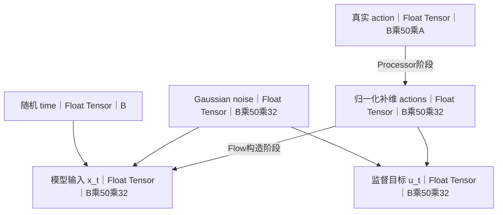

`x_t = time * noise + (1 - time) * actions`；`u_t = noise - actions`。

##### 模型计算与监督

进入时是 `x_t`、time 与条件 embedding，离开时是 `v_t` 和标量 MSE loss。

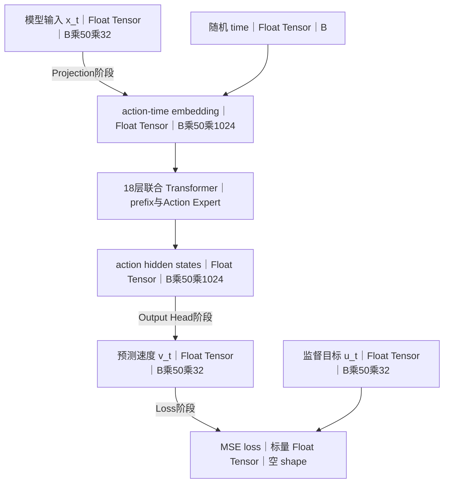

time 的 sinusoidal embedding 与 action projection 经拼接和 MLP 形成 action-time embedding；prefix 与 state 条件也进入联合 Transformer。只有 action 位置参与速度预测，损失为 `mean((v_t - u_t) ** 2)`。

| 阶段 | 进入时 | 离开时 |
|---|---|---|
| Processor | 真实 action | 归一化补维 actions |
| Flow 题目构造 | actions、noise、time | `x_t` 与 `u_t` |
| Projection | `x_t` 与 time | action-time embedding |
| Transformer | 条件与 action-time embedding | action hidden states |
| Output 与 Loss | action hidden states 与 `u_t` | `v_t` 与标量 MSE loss |

#### 推理 action 数据流

推理从观测条件与随机噪声开始，经过固定参数的 10 步 Transformer 积分，最终生成并逐帧执行 action chunk。

##### 条件准备与初始化

进入时是图像、文本、state 观测，离开时是可复用条件与初始噪声 `x_t`。

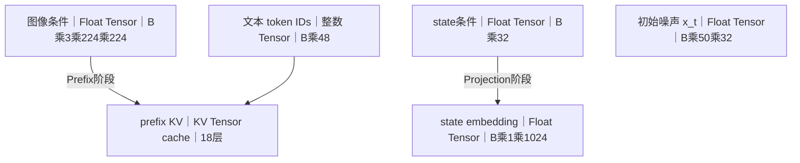

##### 10 步 Transformer 积分

进入时是 prefix KV、state embedding 与当前 `x_t`，离开时是逐渐具有动作语义的最终 `x_t`。

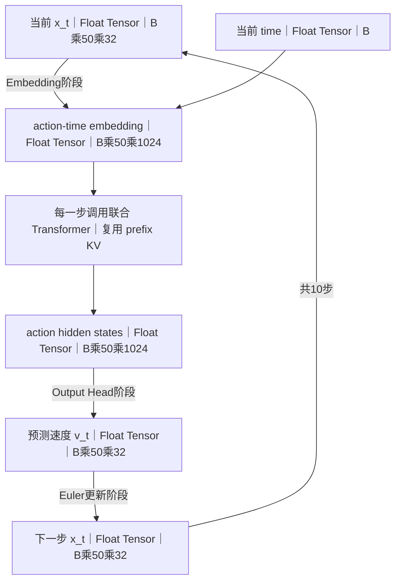

每步执行 `x_t = x_t + dt * v_t`，其中 `dt = -0.1`，time 从 `1.0` 走到 `0.1`。prefix KV 在 10 步中复用，state embedding 与 action-time embedding 构成 suffix；模型参数保持不变，只更新 `x_t`。

##### 后处理与执行

进入时是积分结束的归一化 action，离开时是逐帧下发的硬件命令。

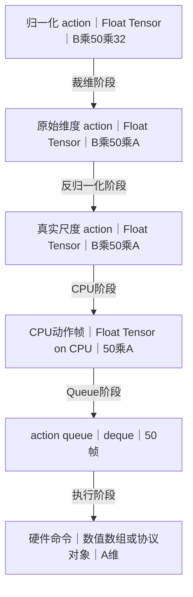

推理没有 `u_t`、loss、反向传播或参数更新。

| 阶段 | 进入时 | 离开时 |
|---|---|---|
| 条件准备 | 图像、文本、state | prefix KV 与 state embedding |
| Flow 初始化 | 随机噪声 | 初始 `x_t` |
| 10 步积分 | 条件与当前 `x_t` | 最终归一化 action |
| Postprocessor | `B乘50乘32` action | `B乘50乘A` 真实尺度 action |
| 控制执行 | CPU action chunk | deque 中逐帧硬件命令 |

### 原理：batch 入口长什么样？

训练时，`update_policy` 从 DataLoader 拿到一个 batch，这是 processor 已经处理好的字典：

| batch 字段 | 值与 shape |
|---|---|
| `observation.images.cam_high` | `Tensor[B, 3, 224, 224]` |
| `observation.images.cam_wrist` | `Tensor[B, 3, 224, 224]` |
| `observation.state` | `Tensor[B, S]` |
| `action` | `Tensor[B, 50, A]` |
| `input_ids` | `LongTensor[B, 48]` |
| `attention_mask` | `LongTensor[B, 48]` |
| `task` | `["pick up cup", ..., "wipe table"]` |

此刻已经发生了 tokenize、归一化、补维度等处理。`modeling_pi0.py` 的 `PI0Policy.forward` 从这个字典取出各字段，传给 `PI0Pytorch.forward` 做实际计算。

### 原理：四种输入分别经历了什么才能拼在一起？

按 [modeling_pi0.py] 的 `PI0Policy.forward` 实际调用顺序：

| 阶段 | 图像 | 文本 | state | action |
|---|---|---|---|---|
| Dataset 原始值 | `[C,H,W]` uint8 | 字符串 | `[S]` 浮点 | `[50,A]` 浮点 |
| Processor 处理后 | `[B,3,224,224]` float | `[B,48]` long | `[B,S]` float | `[B,50,A]` float |
| embedding 前 | 同上 | 同上 | 归一化补到32 | 归一化补到32 |
| 变成 embedding | `embed_image` → `[B,Nv,2048]` | `embed_language_tokens` → `[B,48,2048]` | `state_proj` → `[B,1,1024]` | noise + `x_t` + `action_in_proj` → `[B,50,1024]` |
| Transformer 后 | prefix hidden `[B,Nv+48,2048]` | （同上，包含在 prefix 中） | suffix hidden 的 state 位置 `[B,1,1024]` | suffix hidden 的 action 位置 `[B,50,1024]` |
| 输出 | 不直接输出 | 不直接输出 | 不直接输出 | `action_out_proj` → `[B,50,32]` |
| loss 用 | 无 | 无 | 无 | 与 `u_t` 做 MSE |

也就是说：
- **图像和文本**只作为条件，不直接产生 loss。
- **state** 只作为条件（它拼在 suffix 中，让 action expert 能看到当前状态），不直接产生 loss。
- **只有 action 位置**最终产生预测值并计算 loss。

### 原理：从 processor 出到 embed_prefix/embed_suffix 的具体张量流

按 [modeling_pi0.py#L762-811](file:///home/robot/projects/lerobot/src/lerobot/policies/pi0/modeling_pi0.py#L762-L811) `PI0Pytorch.forward` 的实际调用顺序：

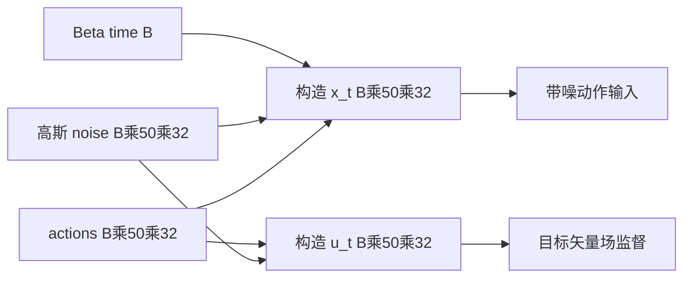

`noise = torch.normal(0, 1, [B, 50, 32])`，`time = Beta(1.5, 1.0) * 0.999 + 0.001 → [B]`，`x_t = time[:,None,None] * noise + (1 - time[:,None,None]) * actions`，`u_t = noise - actions`。

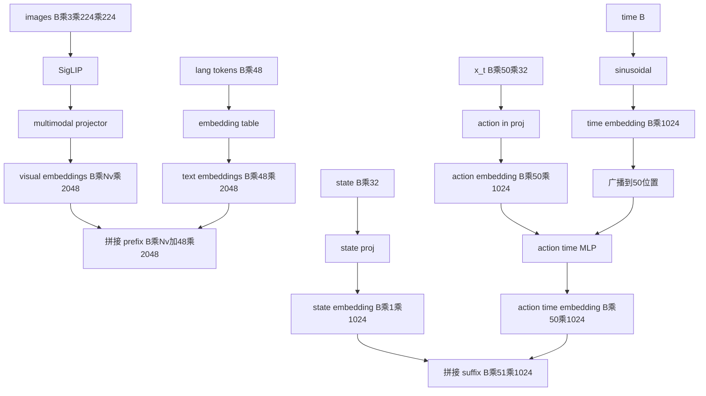

上图的两条入口分别是 `embed_prefix(images, img_masks, lang_tokens, lang_masks)` 和 `embed_suffix(state, x_t, time)`；动作与时间分支执行 `concat(action_emb, time_emb) → action_time_mlp`。

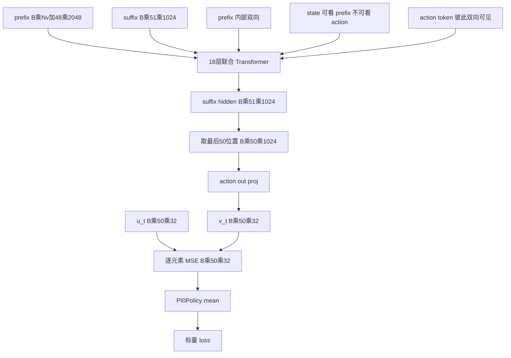

取动作位置的完整切片是 `suffix_out = suffix_out[:, -50:] → [B, 50, 1024]`；输出与损失是 `v_t = action_out_proj(suffix_out) → [B, 50, 32]` 和 `loss = mse_loss(u_t, v_t, reduction='none') → [B, 50, 32]`。

### 原理：推理时的数据流与训练有何不同？

推理时调用 [modeling_pi0.py#L814-895](file:///home/robot/projects/lerobot/src/lerobot/policies/pi0/modeling_pi0.py#L814-L895) `sample_actions`：

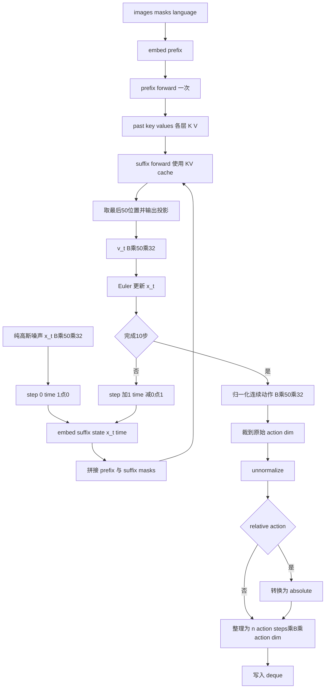

prefix 分支执行 `prefix_embs = embed_prefix(images, img_masks, lang_tokens, lang_masks)`，随后调用 `paligemma.forward(inputs_embeds=[prefix_embs, None], use_cache=True)`。Euler 循环使用 `dt = -0.1`、`for step in range(10)`、`time = 1.0 + step * dt`，时间从 `1.0` 变化到 `0.1`；每步调用 `embed_suffix(state, x_t, time)`，并以 `paligemma.forward(inputs_embeds=[None, suffix_embs], past_key_values=prefix_kv, ...)` 预测速度，最后执行 `x_t = x_t + dt * v_t`。

训练和推理的核心差异：

| | 训练 | 推理 |
|---|---|---|
| 噪声来源 | 每个 batch 随机 | 每轮推理只随机初始化一次 |
| time 采样 | 随机 Beta 分布 | 均匀网格 1.0→0.1 |
| forward 次数 | 每个 batch 1 次 | 每个 action chunk 10 次 |
| prefix KV cache | 不缓存 | 缓存，复用 |
| 梯度 | 有 `backward()` | `torch.no_grad()` |
| 输出 | `v_t` 拿去算 MSE | `x_t` 拿去执行 |

---

# 第一部分：数据采集与数据集实现

## 1. 数据采集主链路

本图采用纵向主链路，避免把 observation 和 action chunk 排成上下两个独立流程。它们最终在同一个样本节点中并排表示。

```mermaid
flowchart TD
    A[1. 确定任务 例如 pick up the cup] --> B[2. 标定 follower robot、teleoperator 和 cameras]
    B --> C[3. 启动固定频率控制循环 例如每 20 ms 一个控制周期]
    C --> D[4. 操作者通过 leader 手柄产生控制目标]
    D --> E[5. 将 action_t 下发给 follower robot]
    E --> F[6. 同一控制周期读取 observation_t]
    F --> G[7. observation_t 包含 camera images + robot state]
    G --> H[8. 将 timestamp、frame_index、episode_index、task 一起写入数据集]
    H --> I{9. episode 是否结束?}
    I -- 否 --> C
    I -- 是 --> J[10. 保存 episode 元数据与视频 图像]
    J --> K[11. 人工或程序检查 episode 质量]
    K --> L{12. 是否有效?}
    L -- 否 --> M[删除 重录该 episode]
    M --> C
    L -- 是 --> N[保留并更新 dataset metadata stats]
```

## 2. 每个控制周期实际记录什么

```mermaid
flowchart TD
    A[控制周期 t 开始] --> B[读取 teleoperator 输入]
    B --> C[转换为机器人 action_t]
    C --> D[robot.send_action action_t]
    D --> E[读取 robot state_t]
    E --> F[读取 camera frame_t]
    F --> G[记录统一 timestamp_t]
    G --> H[构造 frame record]
    H --> I[observation.images   一个或多个 RGB 图像]
    H --> J[observation.state   关节 夹爪等连续数值]
    H --> K[action   实际控制目标]
    H --> L[task   当前 episode 的语言描述]
    H --> M[episode_index + frame_index + timestamp]
    I --> N[写入 LeRobotDataset]
    J --> N
    K --> N
    L --> N
    M --> N
```

这里需要同步记录 action 与 observation，因为训练样本要表达：

`在 observation_t 和语言指令 l 条件下，示范者接下来执行了哪些动作？`

### 展开原理：action、observation 和 timestamp 怎样在一个控制周期内同步？

采集循环以固定 FPS 为目标，每次循环形成一条 frame record，而不是让 action、state、camera 各自独立写一条记录。其逻辑时序是：读取操作者输入并生成 `action_t`，发送动作，随后读取机器人 state 和相机帧，再把这些值连同同一个 `frame_index`、`episode_index`、`task_index` 和 `timestamp` 写入该帧。

这里的“同步”是控制周期级对齐，不表示硬件在完全相同的物理瞬间采样。动作发送、总线读取和相机取帧都需要时间；LeRobot 用统一帧索引和接近 `1/fps` 的 timestamp 间隔，把它们定义为同一离散时间步的数据。数据集加载时还会用 `tolerance_s` 检查 timestamp 是否与 FPS 网格一致。

概念上，一条记录可写成：

| `frame_t` 字段 | 值 |
|---|---|
| `observation.state` | `s_t` |
| `observation.images.*` | `image_t` |
| `action` | `a_t` |
| `timestamp` | `t / fps` |
| `frame_index` | `t` |
| `episode_index` | `e` |
| `task_index` | `k` |

这样训练时才能把当前观测作为条件，把从当前时刻开始的动作作为监督目标。若 action 和 observation 分别按自己的时钟写入、没有共同索引，模型可能学到错位关系，例如用动作执行后的图像去监督动作执行前的目标。


## 3. LeRobotDataset 在磁盘上的职责

```mermaid
flowchart TD
    A[一次有效 episode] --> B[数值字段写入 parquet]
    A --> C[相机帧写入 video 或 image storage]
    A --> D[任务文字写入 tasks metadata]
    A --> E[episode 长度与边界写入 episodes metadata]

    B --> F[data chunk-xxx file-xxx.parquet]
    C --> G[videos 或 images]
    D --> H[meta tasks.parquet]
    E --> I[meta episodes ...]

    F --> J[meta info.json 描述 feature 名称、shape、fps]
    G --> J
    H --> J
    I --> J
    J --> K[meta stats.json 保存 state action 的统计量]
```

`stats.json` 后续用于训练和推理的一致归一化。它不是模型权重，但缺失或不匹配会导致输入输出尺度错误。

### 展开原理：同一个 episode 怎样在 parquet、video 和 metadata 之间关联？

数值 parquet 的每一帧保存 `episode_index`、全局 `index`、episode 内 `frame_index`、`timestamp` 和 `task_index` 等字段。`meta/episodes/...parquet` 则以每个 episode 一行为主，保存该 episode 的长度、全局帧区间 `dataset_from_index:dataset_to_index`，以及它所在的数据/视频 chunk、file 和视频时间范围。它相当于跨文件索引表。

读取第 `e` 个 episode 时，关联过程是：

```mermaid
flowchart TD
    E[episode index e] --> M[查询 episodes metadata]
    M --> R[dataset from index 与 dataset to index]
    R --> P[定位数值帧 data chunk 与 file]
    M --> C[按 camera key 定位 video chunk 与 file]
    C --> F[读取 from timestamp]
    F --> T[计算视频文件内解码时间]
    FT[frame timestamp] --> T
    P --> J[合并同一帧样本]
    T --> J
    TI[frame task index] --> TP[查询 meta tasks parquet]
    TP --> TS[恢复 task 字符串]
    TS --> J
```

视频解码时间的完整计算是 `frame.timestamp + from_timestamp`。

多个 episode 可以共享同一个 parquet 或 mp4 文件，所以不能假设“一个 episode 就对应一个物理文件”。真正稳定的关联键是 metadata 中记录的 `episode_index`、帧范围、chunk/file 索引和视频起止时间。

视频解码时，帧表里的 `timestamp` 是 episode 内相对时间；`DatasetReader` 读取 episode metadata 中对应 camera key 的 `from_timestamp`，二者相加后才得到共享视频文件中的绝对解码时间。数值 state/action 则通过全局帧 `index` 和 episode 边界查询。最终二者重新合并为同一个样本字典。


## 4. π0 如何要求未来 50 步 action

`PI0Config.action_delta_indices` 返回：

`[0, 1, 2, ..., 49]`

数据集根据 FPS 转为相对时间偏移：

`delta_timestamp_i = i / fps`

例如数据集是 50 Hz：

`[0.00 s, 0.02 s, 0.04 s, ..., 0.98 s]`

完整取样过程：

```mermaid
flowchart TD
    A[DataLoader 请求 dataset index] --> B[LeRobotDataset.__getitem__]
    B --> C[定位 index 所属 episode 和当前 frame t]
    C --> D[读取当前 frame 的 images、state、task]
    D --> E[根据 action_delta_indices 查询 t 到 t+49]
    E --> F{是否超出当前 episode 结尾?}
    F -- 否 --> G[读取 50 个真实 action]
    F -- 是 --> H[使用 episode 边界规则补齐并生成 padding 信息]
    G --> I[堆叠为 action tensor shape   50 x action_dim]
    H --> I
    I --> J[形成一个字典样本]
    J --> K[同一个样本中并排包含 observation_t   images + state_t + language target   action_t ... action_t+49]
```

这里不应理解成两个互不相关的分支。`observation_t` 是条件，未来 50 步 `action chunk` 是同一个样本的监督目标。

### 展开原理：`action_delta_indices` 怎样取未来 50 步，越界时怎样 padding？

策略配置给出离散偏移 `[0,1,...,49]`。创建数据集时，这些步偏移按 FPS 转成 delta timestamps；`DatasetReader` 再校验它们确实落在 FPS 网格上，并得到整数 delta indices。对当前全局帧索引 `abs_idx`，每个目标位置先计算：

`raw_index_i = abs_idx + i,  i = 0...49`

episode metadata 提供半开区间：

`[ep_start, ep_end) = [dataset_from_index, dataset_to_index)`

实际读取索引使用边界夹取：

| 项目 | 内容 |
|---|---|
| `query_index_i` | `max(ep_start, min(ep_end - 1, raw_index_i))` |
| `is_pad_i` | `raw_index_i < ep_start or raw_index_i >= ep_end` |

因此靠近 episode 末尾时，不是读取下一个 episode，也不是直接补零，而是重复最后一个有效 action，同时把对应的 `action_is_pad` 标为 `True`。例如当前帧离结尾只剩 3 帧：

| 项目 | 内容 |
|---|---|
| `真实查询` | `[a_t, a_t+1, a_t+2]` |
| `补齐读取` | `[a_last, a_last, ..., a_last]` |
| `action_is_pad` | `[False, False, False, True, ..., True]` |

重复边界值保证返回张量始终是固定的 `50 x action_dim`，便于 batch 堆叠；padding mask 则保留“哪些位置并非真实未来动作”的信息。π0 的模型输入长度因此固定，但训练或其他策略可以根据该辅助字段决定如何处理越界位置。


## 5. DataLoader 如何组成 batch

```mermaid
flowchart TD
    A[从 Dataset 取得多个样本字典] --> B[collate_fn 按相同 key 堆叠]
    B --> C[images B x C x H x W]
    B --> D[state B x state_dim]
    B --> E[action chunk B x 50 x action_dim]
    B --> F[task strings   language fields]
    B --> G[padding is_pad 等辅助字段]
    C --> H[形成一个 training batch]
    D --> H
    E --> H
    F --> H
    G --> H
```

`B` 表示 batch size，不是固定数字。例如 `B=32` 表示一次同时训练 32 个样本。

### 展开原理：DataLoader 的 collate 怎样把样本字典堆叠成 batch？

`Dataset.__getitem__()` 每次返回一个结构相同的 Python 字典。DataLoader 收集 `B` 个样本后，默认 collate 递归遍历容器：相同 key 的 Tensor 用 `torch.stack(..., dim=0)` 增加 batch 维；字符串不转成 Tensor，而是保留为长度为 `B` 的列表；嵌套字典继续按相同规则处理。

例如单样本：

| 字段 | 单样本类型或 shape |
|---|---|
| `observation.state` | `[state_dim]` |
| `action` | `[50, action_dim]` |
| `image` | `[C, H, W]` |
| `task` | `str` |
| `action_is_pad` | `[50]` |

collate 后：

| 字段 | collate 后的类型或 shape |
|---|---|
| `observation.state` | `[B, state_dim]` |
| `action` | `[B, 50, action_dim]` |
| `image` | `[B, C, H, W]` |
| `task` | `list[str]`，长度为 `B` |
| `action_is_pad` | `[B, 50]` |

`stack` 要求同一 key 的各样本 shape 完全一致。这正是 action chunk 固定为 50 步、图像预先具有一致尺寸、越界位置用边界值补齐的原因之一。batch 维只表示并行处理多个独立样本，不会把不同 episode 的时间序列首尾连接起来。


---

# 第二部分：训练输入预处理

## 6. 训练前的 processor pipeline

π0 的预处理由 `make_pi0_pre_post_processors()` 构建。

```mermaid
flowchart TD
    A[DataLoader 原始 batch] --> B[RenameObservationsProcessorStep 统一 observation key]
    B --> C[AddBatchDimensionProcessorStep 单样本推理时补 batch 维]
    C --> D[Pi0NewLineProcessor 任务文字末尾添加换行]
    D --> E[TokenizerProcessorStep]
    E --> E1[文本转为 token IDs]
    E --> E2[生成 language attention mask]
    E1 --> F[DeviceProcessorStep 移动到 CPU GPU]
    E2 --> F
    F --> G[RelativeActionsProcessorStep 可选]
    G --> G1[若启用：action 转为相对当前 state 的变化量]
    G --> G2[若关闭：保留原 action 表示]
    G1 --> H[NormalizerProcessorStep]
    G2 --> H
    H --> H1[state 按 dataset stats 归一化]
    H --> H2[action 按 dataset stats 归一化]
    H1 --> I[送入 PI0Policy.forward 的 batch]
    H2 --> I
```

### 展开原理：TokenizerProcessorStep 怎样把文本变成 token IDs 和 attention mask？

### 1. 输入是什么

假设一个 batch 中的任务文本是：

`["pick up the cup\n", "open the drawer\n"]`

前一步 `Pi0NewLineProcessor` 会保证每条任务文字以换行符结尾。这是为了与 π0 使用的 PaliGemma prompt 格式保持一致。

### 2. 加载的是哪个 tokenizer

π0 processor 使用 Hugging Face 的：

`google/paligemma-3b-pt-224`

`AutoTokenizer.from_pretrained(...)` 会加载它已经训练好的词表和切分规则。Tokenizer 不是临时按字符编号，也不是由 π0 在当前机器人数据上重新训练。

### 3. 文本怎样变成 token IDs

内部实际调用等价于：

`tokenized = tokenizer(task_texts, ...)`，调用参数如下：

| 参数 | 值 |
|---|---|
| `max_length` | `tokenizer_max_length` |
| `truncation` | `True` |
| `padding` | `"max_length"` |
| `padding_side` | `"right"` |
| `return_tensors` | `"pt"` |

转换过程是：

```mermaid
flowchart LR
    A[原始字符串] --> B[PaliGemma 规则切分 token]
    B --> C[固定词表查询整数 ID]
    C --> D[右侧截断超长文本]
    D --> E[右侧补 PAD 到 max length]
    E --> F[堆叠二维 PyTorch tensor]

    X[pick up the cup 加换行] --> Y[pick 与 up 与 the 与 cup 与换行]
    Y --> Z[1204 87 42 931 108]
    Z --> W[1204 87 42 931 108 PAD PAD PAD]
```

下方示例链只用于说明结构，整数不是 PaliGemma 的真实词表编号：`"pick up the cup\n"` → `["pick", " up", " the", " cup", "\n"]` → `[1204, 87, 42, 931, 108]` → `[1204, 87, 42, 931, 108, PAD, PAD, PAD]`。

最终 `input_ids` 的 shape 是：

`B × max_length`

每个整数只表示“词表中的第几个 token”。模型随后通过 embedding table，把每个整数查表转换成连续 hidden vector；tokenizer 本身还没有完成语义理解。

### 4. attention mask 怎样生成

Tokenizer 在 padding 的同时生成同 shape 的 `attention_mask`：

| 项目 | 内容 |
|---|---|
| `input_ids` | `[1204, 87, 42, 931, 108, PAD, PAD, PAD]` |
| `attention_mask` | `[   1,  1,  1,   1,   1,   0,   0,   0]` |

含义是：

- `1`：这里是真实文本 token，后续模型可以使用。
- `0`：这里是为了统一长度补出来的 PAD，后续 attention 应忽略。

代码最后把 mask 转成布尔值，所以实际是 `True/False`。它不是 Transformer 最终的二维 attention 矩阵；它只是最初的一维“哪些文本位置有效”标记，后续还会与图像、state、action 的 mask 合并。

### 5. 写到 batch 的哪些字段

`input_ids      → observation.language.tokens`

`attention_mask → observation.language.attention_mask`

之后 `PI0Policy.forward()` 读取这两个字段。`language.tokens` 进入 PaliGemma embedding table，`language.attention_mask` 参与构造 prefix padding mask。

### 6. 一句话区分两项输出

| 项目 | 说明 |
|---|---|
| `token IDs` | 这个位置是什么 token。 |
| `attention mask` | 这个位置是真实 token，还是为了对齐长度补出的 PAD。 |

对应实现：`processor_pi0.py` 中构造 `TokenizerProcessorStep`；`tokenizer_processor.py` 中 `_tokenize_text()` 和 `observation()` 完成实际转换。


### 展开原理：NormalizerProcessorStep 怎样归一化 state 和 action？

归一化使用数据集 `stats.json` 中统计出的参数，把不同量纲的关节位置、夹爪值等映射到模型更容易处理的统一数值范围。它不是把信息删除，而是改变坐标尺度。

以均值和标准差归一化为例：

`x_normalized = (x - mean) / std`

例如某关节在数据集中的 `mean=1.0`、`std=0.5`，真实值 `x=1.5`：

`x_normalized = (1.5 - 1.0) / 0.5 = 1.0`

训练时 action 目标先归一化，模型预测的也是归一化动作；部署时 `UnnormalizerProcessorStep` 使用相反公式恢复机器人尺度：

`x = x_normalized * std + mean`

因此训练和部署必须加载同一份 dataset stats。


### 展开原理：RelativeActionsProcessorStep 怎样在绝对动作和相对动作之间转换？

该步骤只在 `config.use_relative_actions=True` 时改变 action。它先缓存当前 `observation.state`，然后对需要转换的动作维度执行：

`relative_action[..., j] = absolute_action[..., j] - state[..., j]`

若 action chunk 为 `[B, 50, action_dim]`、state 为 `[B, state_dim]`，state 会在 50 个时间位置上广播。因此 50 步都以当前观测时刻的同一个 `state_t` 为参考：

`relative_chunk[:, i, j] = action[:, i, j] - state_t[:, j]`

这不是 `action_{i+1} - action_i` 的逐步差分。它表达的是“未来目标相对当前机器人状态偏移多少”，让不同初始关节位置下的相似运动更容易共享表示。

转换使用一个布尔 mask。默认没有可用关节名时全部动作维都转相对值；若 `relative_exclude_joints` 与 `action_feature_names` 能匹配，例如排除 `gripper`，被排除维度保持绝对值：

`mask[j] = True  -> action[j] -= state[j]`

`mask[j] = False -> action[j] 不变`

部署后处理中的 `AbsoluteActionsProcessorStep` 使用预处理步骤缓存的同一份 state 和同一 mask 做逆变换：

`absolute_action[..., j] = relative_action[..., j] + cached_state[..., j]`

源码顺序是 `raw -> relative -> normalize -> model -> unnormalize -> absolute`。先恢复数值尺度再加回 state，才能保证两者位于相同的真实机器人坐标系。


图像在 processor 中保持视觉归一化映射，进入 `PI0Policy` 后还会由 `_preprocess_images()` 调整尺寸、通道布局和数值范围，使其符合 PaliGemma/SigLIP 输入要求。

## 7. `PI0Policy.forward()`：模型外层训练入口

```mermaid
flowchart TD
    A[训练脚本调用 policy.forward batch] --> B[_preprocess_images]
    B --> B1[找到配置要求的 camera keys]
    B1 --> B2[转换 dtype device]
    B2 --> B3[处理 BCHW 或 BHWC]
    B3 --> B4[resize pad 到模型图像尺寸]
    B4 --> B5[从 0..1 转为视觉模型需要的范围]
    B5 --> B6[生成每个 camera 的 img_mask]

    A --> C[读取 language token IDs 和 attention mask]
    A --> D[prepare_state]
    D --> D1[pad_vector 到 max_state_dim 32]
    A --> E[prepare_action]
    E --> E1[pad_vector 到 max_action_dim 32]

    E1 --> F[sample_noise 生成同 shape 的高斯噪声]
    E1 --> G[sample_time 每个样本生成一个 time]

    B6 --> H[调用 PI0Pytorch.forward]
    C --> H
    D1 --> H
    E1 --> H
    F --> H
    G --> H

    H --> I[返回逐元素 losses B x 50 x 32]
    I --> J[裁掉 padding action 维度 只保留实际 action_dim]
    J --> K{reduction 参数}
    K -- mean --> L[所有 batch time action 维求 mean 得到标量 loss]
    K -- none --> M[只对 time action 维求 mean 得到 B 个 per-sample loss]
    L --> N[返回 loss + loss_dict]
    M --> N
```

### 展开原理：图像怎样从相机 tensor 变成模型可以读取的 visual tokens？

`_preprocess_images()` 与 `embed_prefix()` 分为两个阶段：

```mermaid
flowchart TD
    A[原始相机 tensor] --> B[确认 BCHW 或 BHWC 通道位置]
    B --> C[等比例 resize]
    C --> D[padding 到固定正方形尺寸]
    D --> E[映射到视觉编码器数值范围]
    E --> F[SigLIP 切分 patch 并编码]
    F --> G[multimodal projector]
    G --> H[连续 visual embeddings B乘Nv乘2048]
```

这里的 visual token 不是类似文本 token ID 的整数。每个图像 patch 经过 SigLIP 后直接成为一个连续向量，再由 projector 做线性/非线性映射，使其维度能够与语言 embedding 一起进入 PaliGemma。

`img_mask` 表示某个 camera 输入是否真实存在。有效 camera 的所有 patch 位置为有效；缺失 camera 对应位置会在后续 attention 中被屏蔽。


### 展开原理：为什么 state/action 要补到 32 维？

不同机器人可能有不同动作维度，例如 7 维、14 维或更多。π0 的输入输出投影层需要固定矩阵尺寸，因此 LeRobot 把最后一维补零到 `max_state_dim=32` 和 `max_action_dim=32`：

| 项目 | 内容 |
|---|---|
| `原 state` | `[q1, q2, q3, q4, q5, q6, gripper]` |
| `补到32维` | `[q1, q2, ..., gripper, 0, 0, ..., 0]` |

补零只是为了让 batch 和线性层 shape 固定。计算 loss 时会根据机器人真实 `action_dim` 裁掉补出的维度，所以这些额外位置不会作为有效机器人动作监督。


---

# 第三部分：一次完整 Flow Matching forward

## 8. `PI0Pytorch.forward()` 总体展开

```mermaid
flowchart TD
    A[输入 images、language、state、actions、noise、time] --> B[time_expanded   time[ , None, None]]
    B --> C[x_t   time*noise + 1-time*actions]
    A --> D[u_t   noise - actions]

    A --> E[embed_prefix images + language]
    C --> F[embed_suffix state + x_t + time]
    A --> F

    E --> G[得到 prefix_embs + prefix masks]
    F --> H[得到 suffix_embs + suffix masks 当前实现 adarms_cond   None]

    G --> I[拼接 pad_masks]
    H --> I
    G --> J[拼接 attention block masks]
    H --> J
    I --> K[make_att_2d_masks]
    J --> K
    I --> L[cumsum 生成 position_ids]
    K --> M[转换为 4D additive attention mask]

    G --> N[PaliGemmaWithExpertModel.forward]
    H --> N
    L --> N
    M --> N
    N --> O[18 层联合 Transformer 前向]
    O --> P[最终 suffix hidden states]
    P --> Q[取最后 50 个 action token]
    Q --> R[action_out_proj Expert hidden -> max_action_dim]
    R --> S[v_t：预测向量场]
    D --> T[MSE 每个元素计算 u_t-v_t 的平方]
    S --> T
    T --> U[返回 B x 50 x 32 的 unreduced losses]
```

## 9. time、noise、`x_t` 和监督速度如何生成

```mermaid
flowchart TD
    A[真实 actions B x 50 x 32] --> D[x_t]
    B[noise ~ N 0,I B x 50 x 32] --> D
    C[time ~ Beta 1.5,1.0 缩放到 0.001..1.0] --> D

    D[x_t   time*noise + 1-time*actions] --> E{time 的含义}
    E --> E1[time 接近 0 x_t 接近真实动作]
    E --> E2[time 接近 1 x_t 接近纯噪声]

    A --> F[u_t   noise - actions]
    B --> F
    F --> G[该路径对 time 的解析导数]
```

注意：Beta(1.5, 1.0) 的概率密度随 `time` 增大，因此比均匀分布更偏向较大的 `time`，也就是偏向噪声较多的位置。训练仍会覆盖整个 `(0,1)` 区间。

### 展开原理：真实 action、noise 和 time 究竟怎样构造训练题目？

对 batch 中每个真实 action chunk `A`，代码随机生成：

`ε ~ N(0, I)`

`τ ~ 0.001 + 0.999 × Beta(1.5, 1.0)`

然后构造位于真实动作与噪声之间的中间点：

`x_τ = τ ε + (1-τ) A`

例如把一个动作维度简化成标量：

| 项目 | 内容 |
|---|---|
| `真实动作 A` | `0.8` |
| `随机噪声 ε` | `-0.4` |
| `随机 time τ` | `0.25` |
| `x_τ` | `0.25×(-0.4) + 0.75×0.8 = 0.5` |
| `目标速度 u_τ` | `ε-A = -1.2` |

模型收到的是 `observation + x_τ + τ`，要求输出接近 `-1.2` 的速度。它不是直接看到 `A` 后把 `A` 复制出来；真实 `A` 只用于构造训练输入和监督答案。

因为直线路径对 `τ` 求导：

`dx_τ/dτ = ε - A`

所以训练目标是 `u_τ=ε-A`。推理时积分方向从 `τ=1` 走向 `τ=0`，步长为负数，因此虽然模型预测的是噪声方向速度，实际更新会朝真实动作方向移动。

每个 batch 只随机选一个 `τ` 并做一次 forward。经过大量 batch，模型才在统计上学习整条时间区间的速度场。


## 10. `embed_prefix()` 具体做什么

```mermaid
flowchart TD
    A[一个或多个 camera image tensors] --> B[逐 camera 检查 img_mask]
    B --> C[SigLIP vision tower]
    C --> D[得到图像 patch features]
    D --> E[multi-modal projector]
    E --> F[转换为 PaliGemma hidden size 的 visual embeddings]

    G[language token IDs] --> H[PaliGemma token embedding table]
    H --> I[text embeddings]

    F --> J[按 camera 顺序收集 visual embeddings]
    I --> J
    J --> K[沿 token 维拼接 prefix_embs]

    B --> L[为有效 缺失图像构造 pad mask]
    G --> M[语言 attention mask 作为 text pad mask]
    L --> N[拼接 prefix_pad_masks]
    M --> N

    K --> O[输出 prefix_embs]
    N --> P[输出 prefix_pad_masks]
    Q[prefix block mask 通常为 0] --> R[输出 prefix_att_masks]
```

prefix 的角色是提供动作生成条件：图像告诉模型当前场景，语言告诉模型目标任务。

## 11. `embed_suffix()` 具体做什么

```mermaid
flowchart TD
    A[state B x 32] --> B[state_proj]
    B --> C[state token embedding]

    D[x_t B x 50 x 32] --> E[action_in_proj]
    E --> F[action hidden B x 50 x expert_width]

    G[time B] --> H[sinusoidal embedding]
    H --> I[time hidden B x time_dim]
    I --> J[沿 50 个动作位置复制 广播]

    F --> K[拼接 action hidden 与 time hidden]
    J --> K
    K --> L[action_time_mlp_in]
    L --> M[SiLU 非线性激活]
    M --> N[action_time_mlp_out]
    N --> O[50 个 action-time tokens]

    C --> P[沿 token 维拼接]
    O --> P
    P --> Q[suffix_embs   state token + 50 action-time tokens]
    Q --> R[构造 suffix pad mask 51 个位置均为有效 token]
    R --> S[构造 block mask state 1，第一个action 1，其余action 0]
    S --> T[输出 suffix embeddings、pad mask、block mask adarms_cond   None]
```

这里的 MLP 不是 Attention。它由线性层和非线性激活组成，负责把动作特征与 time 特征融合成 Expert 可以处理的 hidden vector。当前 LeRobot π0 明确设置 `use_adarms=[False, False]`，所以 `embed_suffix()` 返回的 `adarms_cond` 是 `None`；time 已经通过 action-time MLP 注入，不再通过 AdaRMSNorm 注入。

### 展开原理：一个标量 time 怎样转换成高维 sinusoidal embedding？

输入 `time` 的 shape 是 `[B]`，每个样本只有一个标量。Transformer 不能仅靠一个位置中的单个数字方便地分辨不同时间尺度，因此代码用许多不同周期的正弦和余弦同时表示它。

设输出维度为 `D`，先生成 `D/2` 个从 0 到 1 的比例：

`fraction_k = k / (D/2 - 1)`

再在 `min_period=0.004` 和 `max_period=4.0` 之间按几何比例生成周期：

`period_k = min_period × (max_period/min_period)^fraction_k`

每个周期对应角频率：

| 项目 | 内容 |
|---|---|
| `frequency_k` | `2π / period_k` |
| `angle_k` | `time × frequency_k` |

最后拼接：

`φ(time) = [sin(angle_0), ..., sin(angle_n),`

`cos(angle_0), ..., cos(angle_n)]`

短周期维度随 time 变化很快，用于区分细小时间差；长周期维度变化慢，用于表达整体位于噪声端还是动作端。这个向量不是高斯噪声，它是对同一个 time 标量的确定性编码：同一个 time 每次都会得到同一个 embedding。

得到 `[B, D]` 后，代码把它扩展成 `[B, 50, D]`，使 action chunk 中每个位置都知道当前 flow time。随后每个动作位置执行：

| 项目 | 内容 |
|---|---|
| `action_emb` | `action_in_proj(x_t)` |
| `fused` | `action_time_mlp([action_emb ; φ(time)])` |

因此 time 不会独立成为第 52 个 token，而是融合进全部 50 个 action token。


## 12. pad mask、block mask 和 position IDs 各做什么

```mermaid
flowchart TD
    A[prefix_pad_masks] --> C[torch.cat dim 1]
    B[suffix_pad_masks] --> C
    C --> D[pad_masks 标记真实 token 与 padding token]

    E[prefix_att_masks] --> G[torch.cat dim 1]
    F[suffix_att_masks] --> G
    G --> H[att_masks 标记信息块边界]

    D --> I[make_att_2d_masks]
    H --> I
    I --> J[二维可见性矩阵 query位置 x key位置]
    J --> K[转为 4D mask batch x head x query x key]

    D --> L[torch.cumsum dim 1 - 1]
    L --> M[position_ids]
    M --> N[RoPE 用它编码 token 顺序]
```

三者不能混为一谈：

- `pad_masks`：这个位置是否是有效数据。
- `att_masks`：不同 token 块之间谁可以读取谁。
- `position_ids`：有效 token 在序列中的位置编号。

## 13. 联合 Attention 的可见方向

```mermaid
flowchart TD
    A[prefix query 图像 语言 token] --> B[可读取全部有效 prefix keys values prefix 块内双向可见]
    A --> C[不能读取 state 或 action keys values]

    D[state query] --> E[可读取全部有效 prefix]
    D --> F[可读取自己]
    D --> G[不能读取 action tokens]

    H[action query 50个action-time token中的任意一个] --> I[可读取全部有效 prefix]
    H --> J[可读取 state]
    H --> K[可读取全部50个 action tokens action 块内双向可见]

    C --> L[避免 prefix 依赖训练时的真实 action]
    I --> M[动作预测因此能使用图像、语言和当前 state]
```

`att_masks` 中的 `1` 表示开始一个新的依赖块，`0` 表示与前一个 token 属于同一块。当前 suffix 是 `[state:1, first_action:1, remaining_actions:0...]`，因此 50 个动作位置不是逐 token causal，而是一个内部双向可见的 action block。

### 展开原理：一维 pad/block mask 怎样变成真正的二维 attention 可见性矩阵？

假设用极小序列表示：

| 项目 | 内容 |
|---|---|
| `位置` | `[image, text, state, action1, action2]` |
| `block mask` | `[    0,    0,     1,       1,       0]` |
| `pad mask` | `[    1,    1,     1,       1,       1]` |

先对 block mask 做累计和：

`cumsum = [0, 0, 1, 2, 2]`

对于 query `i` 和 key `j`，代码判断：

`key_block[j] <= query_block[i]`

因此：

- image/text 属于 block 0，只能读取 block 0。
- state 属于 block 1，可以读取 block 0 和自己所在的 block 1。
- action1/action2 属于 block 2，可以读取 block 0、1 和整个 block 2。

随后再与 pad mask 的二维组合相与，把任何包含 PAD 的 query/key 位置关闭。最后布尔矩阵被转成 4D additive mask：

`允许读取 → 加 0`

`禁止读取 → 加一个极大的负数`

Attention logits 加上极大负数后再做 softmax，被禁止位置的概率会接近 0。


## 14. 18 层联合 Transformer：单层完整计算

下面的整张图表示第 `i` 层。相同结构连续运行 18 次，但每层使用不同权重。

```mermaid
flowchart TD
    A[第 i 层输入] --> B1[prefix_hidden VLM width]
    A --> B2[suffix_hidden Expert width]

    B1 --> C1[VLM input RMSNorm]
    B2 --> C2[Expert input RMSNorm 当前实现无 AdaRMS time 条件]

    C1 --> D1[VLM q_proj]
    C1 --> D2[VLM k_proj]
    C1 --> D3[VLM v_proj]

    C2 --> E1[Expert q_proj]
    C2 --> E2[Expert k_proj]
    C2 --> E3[Expert v_proj]

    D1 --> F1[拼接为 Q_all]
    E1 --> F1
    D2 --> F2[拼接为 K_all]
    E2 --> F2
    D3 --> F3[拼接为 V_all]
    E3 --> F3

    F1 --> G[对 Q K 应用 RoPE]
    F2 --> G
    G --> H[QK^T   sqrt head_dim]
    H --> I[加 attention mask]
    I --> J[softmax 得 attention weights]
    F3 --> K[attention weights 乘 V_all]
    J --> K

    K --> L1[按 token 范围切出 prefix attention result]
    K --> L2[按 token 范围切出 suffix attention result]

    L1 --> M1[VLM o_proj]
    L2 --> M2[Expert o_proj]

    B1 --> N1[VLM 第一次残差连接]
    M1 --> N1
    B2 --> N2[Expert 第一次残差连接]
    M2 --> N2

    N1 --> O1[VLM post-attention RMSNorm]
    N2 --> O2[Expert post-attention RMSNorm]

    O1 --> P1[VLM MLP 扩维线性层 + 激活 门控 + 降维线性层]
    O2 --> P2[Expert MLP 独立于 VLM 的参数]

    N1 --> Q1[VLM 第二次残差连接]
    P1 --> Q1
    N2 --> Q2[Expert 第二次残差连接]
    P2 --> Q2

    Q1 --> R1[第 i 层 prefix 输出]
    Q2 --> R2[第 i 层 suffix 输出]
    R1 --> S{是否第 18 层?}
    R2 --> S
    S -- 否 --> T[作为第 i+1 层输入]
    T --> A
    S -- 是 --> U[得到最终 hidden states]
```

### Attention 与 MLP 的分工

| 项目 | 说明 |
|---|---|
| `Attention` | 让一个 token 按权重读取其他 token 的信息。 |
| `MLP` | 对每个 token 自己的 hidden vector 做非线性变换。 |
| `Residual` | 保留原信息，避免深层网络难以训练。 |
| `Norm` | 稳定数值分布。 |

### 展开原理：Q、K、V 到底怎样由 hidden vector 算出来？

对某层输入 hidden matrix `X`，Q、K、V 都是独立线性层的矩阵乘法：

| 项目 | 内容 |
|---|---|
| `Q` | `XW_Q + b_Q` |
| `K` | `XW_K + b_K` |
| `V` | `XW_V + b_V` |

`W_Q/W_K/W_V` 是训练得到的不同参数，不是直接复制 `X`。直觉上：

| 项目 | 说明 |
|---|---|
| `Q` | 当前 token 想查询什么信息 |
| `K` | 每个 token 提供什么可匹配的索引 |
| `V` | 匹配到这个 token 后，实际取回什么内容 |

对 query `i` 和 key `j`，相关性分数为：

`score(i,j) = Q_i · K_j / sqrt(head_dim)`

加入 mask 后做 softmax：

`weight(i,j) = softmax_j(score(i,j) + mask(i,j))`

再对所有 `V_j` 加权求和：

`attention_output_i = Σ_j weight(i,j) V_j`

因此 action token 能根据当前 hidden 内容，对图像 patch、语言 token、state 和其他 action token 分配不同读取权重。训练改变的正是这些投影矩阵以及后续 MLP 等参数，使相关输入得到更合适的权重。

π0 中 VLM 和 Action Expert 各自有独立的 Q/K/V 投影；投影后沿 token 维拼接，在一次联合 attention 中交互，再按 token 范围切回各自分支。


## 15. `action_out_proj` 为什么叫投影回动作空间

```mermaid
flowchart TD
    A[Expert 最终输出 B x 51 x expert_width] --> B[切掉 state token]
    B --> C[保留 50 个 action hidden vectors B x 50 x expert_width]
    C --> D[action_out_proj   nn.Linear]
    D --> E[矩阵乘法 y   xW + b]
    E --> F[v_t B x 50 x max_action_dim]
```

Expert hidden vector 是模型内部表示，例如 1024 维；机器人动作空间只有最多 32 维。`action_out_proj` 的可训练矩阵学习如何把每个高维 hidden vector 转换成每个动作维度上的速度预测，所以称为“投影回动作空间”。

### 展开原理：1024 维 hidden vector 怎样变成 32 个动作速度值？

对每个 action token，Expert 输出一个长度为 1024 的 hidden vector `h_i`。输出层是同一个共享线性层：

`v_i = h_i W_out + b_out`

其中：

| 张量 | shape |
|---|---|
| `h_i` | `[1024]` |
| `W_out` | `[1024, 32]` |
| `b_out` | `[32]` |
| `v_i` | `[32]` |

第 `j` 个动作维度不是简单取 hidden 的第 `j` 项，而是对全部 1024 个 hidden 分量做加权和：

`v_i[j] = Σ_k h_i[k] × W_out[k,j] + b_out[j]`

同一个 `W_out` 会用于 50 个 action token，但每个位置的 `h_i` 不同，所以会输出 50 组不同速度。训练时 MSE 的梯度会更新 `W_out`，也会经它继续传回 Transformer，使 hidden representation 逐渐包含输出各关节速度所需的信息。

32 是统一的最大动作维度。`PI0Policy.forward()` 在计算最终标量 loss 前裁到真实 `action_dim`；推理时 `predict_action_chunk()` 也裁掉补出的维度。


---

# 第四部分：loss、反向传播和优化器更新

## 16. 从逐元素 loss 到标量 loss

```mermaid
flowchart TD
    A[u_t B x 50 x 32] --> C[逐元素做差]
    B[v_t B x 50 x 32] --> C
    C --> D[squared_error   u_t-v_t 的平方]
    D --> E[PI0Pytorch.forward 返回 B x 50 x 32]
    E --> F[PI0Policy 裁掉无效 padding action 维度]
    F --> G{普通训练还是 sample weighting?}
    G -- 普通 --> H[losses.mean batch、50步、action维全部平均]
    G -- 加权 --> I[先得到每个样本 loss 再乘 sample weight 并归一化]
    H --> J[标量 loss]
    I --> J
```

只有标量 loss 才作为常规 `backward()` 的起点。`loss_dict` 中的值主要用于日志，不参与梯度传播。

## 17. `accelerator.backward(loss)` 到底做什么

```mermaid
flowchart TD
    A[标量 loss] --> B[自动微分从 loss 节点开始反向遍历计算图]
    B --> C[action_out_proj]
    C --> C1[计算 dLoss dW_action_out]
    C --> C2[计算传回 suffix hidden 的梯度]

    C2 --> D[第18层 Expert MLP Attention Norm]
    D --> D1[计算各线性权重、bias、Norm 参数的梯度]
    D --> D2[把梯度继续传给第17层]
    D2 --> E[依次经过第17层到第1层]

    E --> F[action_in_proj、state_proj、time MLP]
    F --> F1[计算这些 projector 参数的梯度]

    E --> G{VLM 参数 requires_grad?}
    G -- True --> H[继续计算 VLM 各层和视觉路径的参数梯度]
    G -- False --> I[停止为冻结参数保存 累积梯度]

    C1 --> J[param.grad 中累计梯度]
    D1 --> J
    F1 --> J
    H --> J
```

反向传播不是“模型再次预测一次”。它利用前向传播留下的计算图，逐层应用链式法则：

`dLoss/d参数 = dLoss/d输出 × d输出/d中间量 × d中间量/d参数`

### 展开原理：MSE 的误差怎样真正变成每个参数的梯度？

先看一个预测元素：

`loss = (v_pred - u_target)^2`

对预测值求导：

`dloss/dv_pred = 2(v_pred-u_target)`

例如 `v_pred=0.7`、`u_target=0.5`：

| 项目 | 内容 |
|---|---|
| `loss` | `(0.7-0.5)^2 = 0.04` |
| `dloss/dv_pred` | `2×0.2 = 0.4` |

这个 `0.4` 表示：若预测继续增大，loss 会增大，所以优化时应把造成该预测增大的参数往反方向调整。

假设最后一层为 `v_pred=hW+b`，链式法则继续得到：

| 项目 | 内容 |
|---|---|
| `dloss/dW` | `h^T × dloss/dv_pred` |
| `dloss/db` | `dloss/dv_pred` |
| `dloss/dh` | `dloss/dv_pred × W^T` |

`dloss/dh` 再传入前一层，依次经过 MLP、attention、Q/K/V 投影、输入投影。PyTorch 在 forward 时记录这些运算关系，`backward()` 按相反顺序调用各运算的导数规则，并把结果累积到每个可训练参数的 `.grad`。

Optimizer 随后读取 `.grad` 更新参数。它不是用 `真实动作 ÷ 输入` 直接求权重，而是利用局部导数判断每个参数改变一点会让总 loss 怎样变化。


## 18. 一个 Linear 层的梯度直觉

对 `y=xW+b`：

```mermaid
flowchart TD
    A[前向输入 x] --> B[y   xW+b]
    C[当前权重 W 和 bias b] --> B
    B --> D[后续网络与 loss]
    D --> E[反向传来 dLoss dy]
    E --> F[计算 dLoss dW 哪些权重导致了误差]
    E --> G[计算 dLoss db]
    E --> H[计算 dLoss dx 继续传给前一层]
    F --> I[保存到 W.grad]
    G --> J[保存到 b.grad]
    H --> K[继续反向传播]
```

PyTorch 自动完成这些矩阵求导，代码不需要手写导数公式。

## 19. 梯度裁剪、AdamW 更新和清零

```mermaid
flowchart TD
    A[backward 完成 每个可训练参数都有 param.grad] --> B[计算所有梯度的整体 norm]
    B --> C{grad_norm 是否超过阈值 1.0?}
    C -- 是 --> D[按比例缩小所有梯度 保持方向，限制总长度]
    C -- 否 --> E[保留原梯度]
    D --> F[optimizer.step]
    E --> F

    F --> G[AdamW 读取当前梯度]
    G --> H[更新一阶动量估计 m]
    H --> I[更新二阶平方梯度估计 v]
    I --> J[根据 learning rate、m、v 计算参数更新量]
    J --> K[应用 weight decay]
    K --> L[写回新的参数值]
    L --> M[optimizer.zero_grad]
    M --> N[将本 batch 梯度清空]
    N --> O[lr_scheduler.step]
    O --> P[更新下一 batch 使用的学习率]
```

如果不调用 `zero_grad()`，下一个 batch 的梯度会和当前 batch 累加；LeRobot 当前训练循环在 `optimizer.step()` 后清零。

### 展开原理：AdamW 怎样把 `.grad` 转换成一次参数更新？

对参数 `θ` 在当前 step 得到的梯度 `g_t`，AdamW 不直接执行 `θ←θ-lr×g_t`，而是维护两份历史统计：

| 项目 | 内容 |
|---|---|
| `m_t` | `β1 m_t-1 + (1-β1) g_t` |
| `v_t` | `β2 v_t-1 + (1-β2) g_t²` |

π0 默认 `β1=0.9`、`β2=0.95`。`m_t` 是平滑后的一阶方向，`v_t` 记录近期梯度平方大小。做偏差修正后，参数更新近似为：

`θ ← θ - lr × m_hat / (sqrt(v_hat)+eps)`

这使近期梯度一直较大的参数获得更小的有效步长，梯度较小的参数获得相对更大的步长。AdamW 再独立应用 weight decay：

`θ ← θ - lr × weight_decay × θ`

这里默认 `weight_decay=0.01`。它与把 L2 项混进 Adam 梯度不同，因而称为 decoupled weight decay。

在进入 AdamW 前，`clip_grad_norm_` 会计算全部参数梯度组成的整体 L2 norm。若超过 1.0，统一乘以：

`scale = 1.0 / grad_norm`

这样保持所有梯度之间的方向比例，只限制一次更新可能过大的整体幅度。`optimizer.step()` 写回新参数后，`zero_grad()` 清除旧 `.grad`，scheduler 再确定下一个 batch 使用的 learning rate。


## 20. 一次真实训练 step 的代码层级

```mermaid
flowchart TD
    A[lerobot_train.train 主循环] --> B[next dataloader batch]
    B --> C[update_policy]
    C --> D[policy.train]
    D --> E[accelerator.autocast 可选混合精度]
    E --> F[PI0Policy.forward]
    F --> G[PI0Pytorch.forward]
    G --> H[标量 loss 返回训练脚本]
    H --> I[accelerator.backward]
    I --> J[clip_grad_norm]
    J --> K[optimizer.step]
    K --> L[optimizer.zero_grad]
    L --> M[lr_scheduler.step]
    M --> N[记录 loss、grad_norm、lr、显存和耗时]
    N --> O{到达 save eval step?}
    O -- 是 --> P[保存 checkpoint 或运行验证]
    O -- 否 --> Q[训练 step + 1]
    P --> Q
    Q --> R{达到总 steps?}
    R -- 否 --> B
    R -- 是 --> S[训练完成]
```

### 展开原理：训练 checkpoint 保存了什么，部署时怎样恢复同一套计算？

模型参数只保存了函数 `v_θ(...)` 中的 `θ`，但完整部署还需要与训练一致的配置和数据变换。一个可复用 checkpoint 通常包含或关联：

```mermaid
flowchart TD
    C[可复用 checkpoint]
    C --> W[模型权重]
    W --> WV[VLM]
    W --> WA[Action Expert]
    W --> WP[state action time projector]
    W --> WO[输出层参数]

    C --> CFG[运行配置]
    CFG --> MC[模型配置]
    MC --> MD[chunk size 与最大 state action 维度]
    MC --> MI[图像尺寸与推理步数]
    CFG --> PC[processor 配置]
    PC --> PT[tokenizer 名称与文本最大长度]
    PC --> PN[归一化模式与 relative action 设置]

    C --> DS[归一化统计]
    DS --> ST[各 state action 维度 mean std]
    DS --> DT[dataset stats]

    C --> RS[训练恢复状态]
    RS --> RO[optimizer 动量 m v]
    RS --> RL[scheduler step 与当前训练 step]
    RS --> RR[随机状态]
```

仅有模型权重但使用了不同 tokenizer、不同 action 维度顺序或不同 stats，即使矩阵 shape 能运行，输入输出语义也可能错位。

部署加载后调用 `eval()`，让模型进入推理模式；`torch.no_grad()` 不再建立反向计算图。参数值固定，但每次 observation、noise、time 和中间 `x_t` 不同，所以 forward 输出仍会变化。


---

# 第五部分：推理与 Flow Matching 积分

## 21. 推理预处理

```mermaid
flowchart TD
    A[当前机器人原始 observation] --> B[preprocessor]
    B --> C[重命名 observation keys]
    C --> D[补 batch 维度]
    D --> E[任务文本添加换行并 tokenize]
    E --> F[state 按训练 stats 归一化]
    F --> G[移动到模型 device]
    G --> H[PI0Policy.predict_action_chunk]
    H --> I[_preprocess_images]
    H --> J[prepare_state pad 到 32维]
    I --> K[PI0Pytorch.sample_actions]
    J --> K
```

## 22. 为什么先只运行 prefix

```mermaid
sequenceDiagram
    participant O as 当前图像+语言
    participant V as PaliGemma 18层
    participant C as past_key_values
    participant E as Action Expert
    participant X as x_t

    O->>V  embed_prefix
    V->>C  每层保存 prefix K V
    Note over V,C  同一个 chunk 的10步中只计算一次

    loop 10个 flow steps
        X->>E  state + 当前x_t + 当前time
        C->>E  提供已缓存的prefix K V
        E->>X  预测v_t并执行Euler更新
    end
```

这里不是没有 suffix，而是：

```mermaid
flowchart TD
    O[当前 observation] --> P[prefix forward]
    P --> K[缓存 prefix K V]
    K --> S[suffix forward]
    S --> U[Euler 更新 x_t]
    U --> C{当前 chunk 完成}
    C -- 否 --> S
    C -- 是 --> N[重新观测]
    N --> P
```

第一次调用 `inputs_embeds=[prefix_embs, None]`，只计算不变的 prefix 并缓存 K/V。随后每一步调用 `inputs_embeds=[None, suffix_embs]`，重新计算变化的 suffix。下一次重新观测、生成新 chunk 时图像发生变化，因此必须重新计算 prefix cache。

### 展开原理：KV cache 缓存的究竟是什么，为什么 Q 不缓存？

在每一层 attention 中，prefix hidden states 会产生：

| 项目 | 内容 |
|---|---|
| `K_prefix` | `X_prefix W_K` |
| `V_prefix` | `X_prefix W_V` |

同一个 action chunk 的 10 个 flow steps 中，图像和语言不变，因此每层的 `K_prefix`、`V_prefix` 也不变。第一次 prefix forward 把 18 层的这些 tensor 保存到 `past_key_values`。

每个 denoise step 的 suffix 不同，因为 `x_t` 和 `time` 都变了，所以 suffix 的 Q/K/V 必须重算。当前 suffix query 使用自己的 `Q_suffix`，与缓存的 `K_prefix` 计算相关性，再读取缓存的 `V_prefix`：

| 项目 | 内容 |
|---|---|
| `score_to_prefix` | `Q_suffix K_prefix^T` |
| `read_prefix` | `softmax(score_to_prefix) V_prefix` |

Q 表示“当前 query 此刻想找什么”。suffix 每一步都变化，Q 也随之变化，因此不能沿 10 步复用。缓存 K/V 的收益是避免重复运行昂贵且不变的图像、语言 prefix 路径。

当机器人重新观测后，图像 token 改变，prefix K/V 也会改变，所以新 chunk 必须重新建立 cache。


## 23. `sample_actions()` 完整调用链

```mermaid
flowchart TD
    A[sample_actions 开始 torch.no_grad] --> B[读取 num_inference_steps 默认 10]
    B --> C[读取 batch size 和 device]
    C --> D{是否传入指定 noise?}
    D -- 否 --> E[采样 B x 50 x 32 高斯噪声]
    D -- 是 --> F[使用传入 noise]
    E --> G[x_t   noise]
    F --> G

    A --> H[embed_prefix images + language]
    H --> I[生成 prefix mask 和 position_ids]
    I --> J[PaliGemmaWithExpertModel.forward]
    J --> K[inputs_embeds   prefix_embs, None]
    K --> L[use_cache   True]
    L --> M[得到 18 层 past_key_values]

    G --> N[dt   -1 10   -0.1]
    M --> O[进入 step 0...9 循环]
    N --> O
    O --> P[time   1 + step*dt]
    P --> Q[构造 batch time_tensor]
    Q --> R[调用 denoise_step]
    R --> S[得到 v_t]
    S --> T[x_t   x_t + dt*v_t]
    T --> U{已经完成第10步?}
    U -- 否 --> O
    U -- 是 --> V[返回最终 x_t]
```

## 24. 单个 `denoise_step()` 内部做什么

```mermaid
flowchart TD
    A[输入 state、当前 x_t、当前 timestep、prefix cache] --> B[embed_suffix]
    B --> B1[state_proj]
    B --> B2[action_in_proj x_t]
    B --> B3[sinusoidal timestep embedding]
    B2 --> B4[action-time MLP 融合]
    B3 --> B4
    B1 --> C[得到当前 suffix embeddings]
    B4 --> C

    C --> D[计算 suffix_len、prefix_len、batch_size]
    D --> E[构造 suffix 查询 prefix 的 mask]
    E --> F[构造 suffix 内部 attention mask]
    F --> G[沿 key 维拼接为 full attention mask]

    D --> H[用 prefix 有效长度计算 suffix position offset]
    H --> I[生成 suffix position_ids]

    G --> J[复制 prefix past_key_values]
    I --> K[PaliGemmaWithExpertModel.forward]
    J --> K
    K --> L[inputs_embeds   None, suffix_embs]
    L --> M[Expert 复用 prefix K V 完成18层计算]
    M --> N[取 outputs_embeds 中 Expert 输出]
    N --> O[只保留最后50个 action token]
    O --> P[action_out_proj]
    P --> Q[返回当前 v_t]
```

## 25. 10 步 Euler 积分逐步展开

LeRobot 实现采用：

`v_t ≈ noise - action`

`dt = -0.1`

`x_next = x_t + dt * v_t`

负步长使更新从噪声端走向动作端。

```mermaid
flowchart TD
    A[初始 x_1   noise] --> B[step 0  time 1.0]
    B --> C[denoise_step 预测 v_1]
    C --> D[x_0.9   x_1 - 0.1*v_1]
    D --> E[step 1  time 0.9]
    E --> F[重新编码 x_0.9 + time 0.9]
    F --> G[预测 v_0.9]
    G --> H[x_0.8   x_0.9 - 0.1*v_0.9]
    H --> I[按相同方式继续 time 0.8...0.2]
    I --> J[step 9  time 0.1]
    J --> K[预测 v_0.1]
    K --> L[x_0.0近似   x_0.1 - 0.1*v_0.1]
    L --> M[最终 50步归一化 action chunk]
```

`sample_actions()` 管理整个 10 步循环；`denoise_step()` 只负责其中一次速度预测。两者不是两个重复的去噪过程。

### 展开原理：Euler 更新为什么能把随机噪声逐步变成动作？

模型学到的是条件速度函数：

`v_θ(observation, x_t, t)`

它回答的是：“在当前 observation 条件下，位于 `x_t`、时间为 `t` 时，沿训练路径的局部速度应是多少？”

Euler 法用一个很小的时间步，把局部速度近似成这一小段内不变：

`x_next = x_current + dt × v_θ(...)`

π0 从 `t=1` 的噪声端走到 `t=0` 的动作端，所以 `dt=-0.1`。例如单一维度：

| 项目 | 内容 |
|---|---|
| `当前 x_1.0` | `-0.4` |
| `模型预测 v_1.0` | `-1.2` |
| `dt × v` | `(-0.1)×(-1.2) = +0.12` |
| `x_0.9` | `-0.4 + 0.12 = -0.28` |

下一步模型会重新读取更新后的 `x_0.9` 和 `t=0.9`，给出新的局部速度，而不是永远重复第一次的 `-1.2`。连续重复 10 次后得到对 `x_0` 的数值近似。

这里的“靠近真实动作”不是拿某个未知真实动作逐步做差。推理阶段没有真实 action；方向来自训练后固定参数中的统计规律，并由当前图像、语言、state、`x_t` 和 `t` 共同决定。

步数越多，通常对连续轨迹的数值近似越细，但计算也越多；LeRobot 当前默认用 10 步。


---

# 第六部分：输出后处理与机器人部署

## 26. 从模型输出到机器人动作

```mermaid
flowchart TD
    A[sample_actions 输出 B x 50 x 32] --> B[predict_action_chunk 裁掉 padding 维度]
    B --> C[B x 50 x actual_action_dim]
    C --> D[postprocessor]
    D --> E[UnnormalizerProcessorStep 恢复真实数值尺度]
    E --> F{训练是否使用 relative action?}
    F -- 是 --> G[AbsoluteActionsProcessorStep 结合当前 state 恢复绝对动作]
    F -- 否 --> H[保持原动作表示]
    G --> I[移动到 CPU]
    H --> I
    I --> J[得到可发送给机器人的 action chunk]
```

### 展开原理：归一化 action chunk 怎样恢复成机器人真实控制值？

模型内部输出仍处于训练数据的归一化坐标系。第一步先把统一的 32 维裁回机器人真实动作维度：

`[B, 50, 32] → [B, 50, actual_action_dim]`

π0 当前配置对 ACTION 使用 `MEAN_STD`，所以 `UnnormalizerProcessorStep` 对每个动作维度执行：

`action_real = action_normalized × std + mean`

`mean/std` 必须来自训练时同一数据集的 stats。例如归一化预测为 `0.5`，该关节 `mean=1.0`、`std=0.4`：

`action_real = 0.5×0.4 + 1.0 = 1.2`

如果训练时启用了 relative action，这个 `1.2` 仍表示相对当前 state 的偏移，随后再执行：

`action_absolute = action_relative + cached_state`

被配置为排除的维度，例如默认可能排除 `gripper`，不会加 state，保持模型预测的绝对表示。最后 tensor 移到 CPU，交给机器人通信层转换成硬件接口需要的命令格式。

这里必须按 `model output → unnormalize → absolute` 的顺序。若先把归一化 action 与真实 state 相加，两者不在同一个数值尺度中，结果没有物理意义。


## 27. 标准同步 `select_action()` 队列

```mermaid
flowchart TD
    A[控制循环调用 select_action batch] --> B[policy.eval + no_grad]
    B --> C{_action_queue 是否为空?}
    C -- 是 --> D[predict_action_chunk]
    D --> E[取前 n_action_steps]
    E --> F[transpose 为 time x batch x action_dim]
    F --> G[extend 写入 _action_queue]
    C -- 否 --> H[不运行模型]
    G --> I[popleft 取队首一个动作]
    H --> I
    I --> J[返回当前控制周期动作]
    J --> K[机器人底层控制器执行]
    K --> L[下一个控制周期再次调用 select_action]
    L --> C
```

当前默认 `n_action_steps=50`，所以标准同步路径通常执行完 50 个队列动作后才重新预测。它不是固定在 30% 阈值提前触发。

### 展开原理：为什么 action chunk 要 transpose 后再放进 deque？

`predict_action_chunk()` 返回：

`shape = [batch, time, action_dim]`

`= [B, 50, A]`

但控制循环每次需要的是“所有 batch 在当前一个时间步的动作”，shape 应为 `[B,A]`。因此先交换 batch/time 维：

`actions.transpose(0,1)`

`[B, 50, A] → [50, B, A]`

`deque.extend(...)` 会沿最外层迭代，于是写入 50 个队列元素：

`queue[0] shape = [B,A]  # 第0个控制动作`

`queue[1] shape = [B,A]  # 第1个控制动作`

`...`

`queue[49] shape = [B,A]`

每次 `select_action()` 调用执行 `popleft()`，以 O(1) 复杂度取出最早动作。队列非空时不会运行模型，只执行之前生成的动作；队列为空时才读取传入的最新 observation 并生成新 chunk。

`n_action_steps` 决定每次预测后实际放入多少步，而 `chunk_size=50` 是模型生成长度。若把 `n_action_steps` 配成 10，模型仍生成 50 步，但同步队列只执行前 10 步，随后基于新 observation 再预测；默认二者都是 50。

这种同步模式在模型推理期间会阻塞控制循环。RTC/异步部署通过在旧动作执行期间并行请求新 chunk 来减少这段等待，但那是额外调度机制，不改变 deque 中每个元素代表一个控制时间步的含义。


## 28. 重新观测与新 chunk 的关系

```mermaid
flowchart TD
    A[根据 observation_0 生成 chunk_0] --> B[队列执行 a_0]
    B --> C[执行 a_1...a_49]
    C --> D[队列耗尽]
    D --> E[读取当前最新 observation_1]
    E --> F[重新计算 prefix K V]
    F --> G[重新采样新 noise]
    G --> H[执行新的10步积分]
    H --> I[得到 chunk_1]
    I --> J[写入队列继续执行]
```

每个新 chunk 都会重新采样噪声，也会根据新的图像/state 重新推理。一个 chunk 内的 10 步积分共享同一个初始噪声轨迹和 prefix cache。

## 29. RTC/异步部署是额外部署层

```mermaid
flowchart TD
    A[标准同步 select_action] --> B[队列空才生成新 chunk]
    C[RTC 或异步 server client] --> D[机器人继续执行旧动作时并行预测]
    D --> E[传入 inference_delay、旧 chunk 剩余动作、execution_horizon]
    E --> F[RTCProcessor 调整 denoise_step 新旧 chunk 对齐]
    F --> G[减少等待或动作断点]
```

RTC/异步机制不是 Flow Matching 数学定义的一部分。Flow Matching 负责生成 chunk；部署层决定什么时候请求、如何缓冲和如何处理旧 chunk。

### 展开原理：异步预测为什么不能直接用新 chunk 覆盖旧 queue？

同步模式中，模型开始推理时机器人通常等待；异步模式中，机器人仍在执行旧 chunk。若一次推理耗时相当于 `d` 个控制周期，那么新 chunk 返回时，机器人状态已经从请求时刻向前移动了约 `d` 步。

| 项目 | 说明 |
|---|---|
| `请求时` | 旧 queue 正在执行 a_k |
| `推理期间` | 机器人继续执行 a_k, a_k+1, ..., a_k+d-1 |
| `返回时` | 机器人已经位于更晚的状态 |

新 chunk 是根据请求时 observation 生成的。如果返回后从它的第 0 步直接覆盖当前队列，可能重复执行已经发生过的运动，或在关节空间产生突然跳变。

异步/RTC 层因此需要知道：

| 异步/RTC 信息 | 含义 |
|---|---|
| `inference_delay` | 推理期间经过了多少控制步 |
| `prev_chunk_left_over` | 旧 chunk 还剩哪些动作 |
| `execution_horizon` | 计划执行新 chunk 的哪一段 |

RTCProcessor 在 denoise/对齐过程中使用这些信息，让新预测与正在执行的旧轨迹保持时间一致。其他异步方案也可能丢弃新 chunk 前 `d` 步、比较新旧关节动作的相似度，或选择平滑衔接点。具体策略不同，但共同目标是避免“基于过去 observation 的第 0 步动作”突然替换“机器人当前时刻应执行的动作”。

因此异步优化的是调度和轨迹衔接，不是改变 Flow Matching 学到的速度场公式。


---

# 第七部分：端到端总图

## 30. 数据准备后，训练与部署分开

```mermaid
flowchart TD
    A[遥操作采集同步 episodes] --> B[LeRobotDataset parquet + videos + metadata + stats]
    B --> C[按当前 frame 和未来50个 action 组成样本]
    C --> D[DataLoader 组成 batch]

    D --> E{训练分支}
    E --> F[processor  tokenize + normalize + device]
    F --> G[PI0Policy.forward]
    G --> H[PI0Pytorch.forward]
    H --> I[随机 time noise 构造 x_t]
    I --> J[prefix suffix embeddings + masks]
    J --> K[18层联合 VLM Expert Transformer]
    K --> L[action_out_proj 得到 v_t]
    L --> M[MSE 得标量 loss]
    M --> N[backward 计算所有可训练参数梯度]
    N --> O[gradient clipping + AdamW step]
    O --> P[重复大量 batch]
    P --> Q[保存 checkpoint + processor stats]

    Q --> R{部署分支}
    R --> S[加载 checkpoint 和相同 processors]
    S --> T[读取当前图像 state 语言]
    T --> U[prefix 前向一次并缓存18层 K V]
    U --> V[采样纯高斯动作噪声]
    V --> W[10次 denoise_step + Euler 更新]
    W --> X[得到50步归一化 action chunk]
    X --> Y[裁维度 + 反归一化 + 可选恢复绝对动作]
    Y --> Z[写入 action queue]
    Z --> AA[控制循环逐步发送]
    AA --> AB{队列耗尽 部署策略请求新 chunk?}
    AB -- 否 --> AA
    AB -- 是 --> T
```

## 31. 训练与推理最终对照

| 项目 | 训练 | 推理 |
|---|---|---|
| 真实 action | 数据集中已知 | 未知，需要生成 |
| noise | 每个 batch 随机采样 | 每个新 chunk 随机采样 |
| time | 每个样本随机采一个 | `1.0, 0.9, ..., 0.1` |
| Flow 模型计算 | 每个 batch 一次 | 每个 chunk 默认 10 次 |
| prefix | 与 suffix 一起运行 | 单独运行一次并缓存 K/V |
| suffix | `state + x_t + random time` | 每步重算 `state + current x_t + current time` |
| 模型输出 | `v_t` 后计算 MSE | `v_t` 后执行 Euler 更新 |
| 自动微分 | 有，调用 `backward()` | 无，`torch.no_grad()` |
| 参数更新 | AdamW 更新可训练参数 | 参数固定 |
| 最终产物 | checkpoint | action chunk |
| 机器人执行 | 不执行 | 经 postprocessor 后进入 action queue |

## 32. 最短但完整的链式总结

### 数据阶段

```mermaid
flowchart TD
    A[校准机器人和相机] --> B[遥操作同步记录]
    B --> C[image state action task timestamp]
    C --> D[保存 episodes 与 LeRobotDataset]
    D --> E[读取当前 observation_t]
    D --> F[按 delta indices 读取未来50步 action]
    E --> G[DataLoader 组成 batch]
    F --> G
    G --> H[tokenizer 归一化 device 预处理]
```

### 训练阶段

```mermaid
flowchart TD
    A[预处理 batch] --> B[采样 noise 与 time]
    B --> C[构造 x_t 与 u_t]
    C --> P[图像与语言编码 prefix]
    C --> S[state x_t time 编码 suffix]
    P --> M[构造 padding attention position masks]
    S --> M
    M --> T[18层联合 VLM 与 Action Expert]
    T --> V[action out proj 输出 v_t]
    V --> L[MSE 标量 loss]
    L --> BWD[backward 链式求梯度]
    BWD --> CLIP[梯度裁剪]
    CLIP --> OPT[AdamW 更新并清空梯度]
    OPT --> R{训练完成}
    R -- 否 --> A
    R -- 是 --> CK[保存 checkpoint]
```

### 部署阶段

```mermaid
flowchart TD
    O[读取新 observation] --> P[prefix forward 一次]
    P --> K[缓存 K V]
    K --> N[纯噪声 B乘50乘32]
    N --> E[10步 denoise 与 Euler 更新]
    E --> C[50步 action chunk]
    C --> U[裁维度并反归一化]
    U --> R[恢复 relative 或 absolute 表示]
    R --> Q[写入 action queue]
    Q --> X[每个控制周期执行一个动作]
    X --> D{队列耗尽或策略触发}
    D -- 否 --> X
    D -- 是 --> O
```

训练目标的完整关系仍是 `x_t = time[:,None,None] * noise + (1 - time[:,None,None]) * actions` 与 `u_t = noise - actions`。
